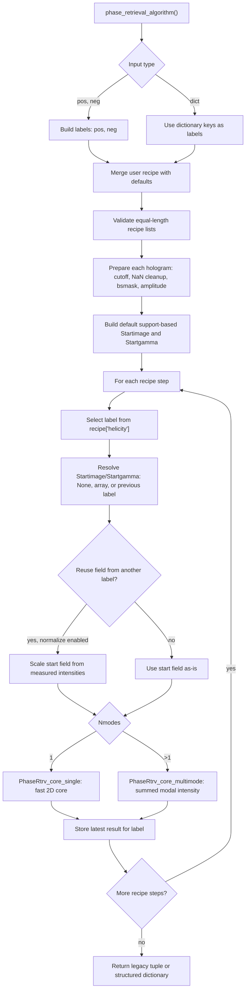

# Unified Phase Retrieval Core

Library file: `library/phase_retrieval_core_unified.py`

Example notebook: `notebooks/12_phase_retrieval_core_unified.ipynb`

This is the usage guide for the unified phase-retrieval driver. The module is
meant to replace the ordinary two-helicity workflow when you want one interface
that can also reconstruct an arbitrary number of labeled holograms and, when
requested, use incoherent multimode phase retrieval.

The module deliberately does not contain charge/magnetic separation or physical
object-model constraints. It reconstructs measured holograms as independent
labels, including the familiar two-helicity `pos`/`neg` input pattern from
`phase_retrieval_core`.

## What It Provides

- Legacy two-hologram input:

```python
result = pr.phase_retrieval_algorithm(pos, neg, mask_pixel, supportmask, recipe)
```

- General labeled input:

```python
holograms = {"pos": pos, "neg": neg, "LH": LH, "LV": LV}
result = pr.phase_retrieval_algorithm(holograms, mask_pixel, supportmask, recipe)
```

- Fast single-mode and multimode dispatch:

```python
pr.PhaseRtrv_core(..., Nmodes=1)  # uses PhaseRtrv_core_single
pr.PhaseRtrv_core(..., Nmodes=3)  # uses PhaseRtrv_core_multimode
```

`Nmodes == 1` uses the simple two-dimensional core copied from
`phase_retrieval_core`, without creating or iterating over a modal axis. This is
important for speed. `Nmodes > 1` uses the multimode summed-intensity Fourier
constraint.

## Quick Start

```python
from library import phase_retrieval_core_unified as pr

holograms = {
    "pos": pos,
    "neg": neg,
    "LH": LH,
    "LV": LV,
}

recipe = {
    "algorithm_list": ["HAPRE", "ER", "ER", "ER"],
    "number_iterations": [200, 40, 40, 40],
    "helicity": ["pos", "neg", "LH", "LV"],
    "beta_zero": [0.5, 0.5, 0.5, 0.5],
    "beta_mode": ["arctan", "const", "const", "const"],
    "alpha_zero": [0.0, 0.0, 0.0, 0.0],
    "alpha_mode": ["const", "const", "const", "const"],
    "RL_its": [0, 0, 0, 0],
    "RL_freqs": [1e9, 1e9, 1e9, 1e9],
    "TV_freqs": [1e9, 1e9, 1e9, 1e9],
    "plot_every": [50, 10, 10, 10],
    "average_img": [10, 10, 10, 10],
    "Fourier_last": [True, True, True, True],
    "Startimage": [None, "pos", "neg", "LH"],
    "Startgamma": [None, None, None, None],
    "Nmodes": 1,
    "normalize_startimage_between_holograms": True,
}

result = pr.phase_retrieval_algorithm(
    holograms,
    mask_pixel,
    supportmask,
    recipe,
)
```

The old two-helicity call still works and returns the historical tuple:

```python
(
    retrieved_p,
    retrieved_n,
    retrieved_p_pc,
    retrieved_n_pc,
    bsmask_p,
    bsmask_n,
    gamma_p,
    gamma_n,
    error,
) = pr.phase_retrieval_algorithm(pos, neg, mask_pixel, supportmask, recipe)
```

Dictionary input returns a structured dictionary:

```python
result["full_coherence"]["pos"]
result["full_coherence"]["LH"]
result["partial_coherence"]["neg"]
result["bsmasks"]["LV"]
result["gamma"]["pos"]
result["error"]["steps"]
```

## Flowchart



## Recipe Structure

The recipe is a flat schedule. Every list-valued per-step key must have the
same length. Step `i` uses the `i`th entry from every list.

| Key | Type | Meaning |
| --- | --- | --- |
| `algorithm_list` | list of strings | Phase-retrieval update for each step. Allowed: `ER`, `SF`, `HAPRE`, `RAAR`, `HIOs`, `HIO`, `OSS`, `CHIO`, `HPR`, `gradient_descent`. |
| `number_iterations` | list of positive ints | Number of iterations for each step. |
| `helicity` | list of strings | Hologram label used for each step. Kept for compatibility with old recipes; in this module it means "dictionary key". |
| `beta_zero` | list of numbers | Initial or constant beta value, depending on `beta_mode`. |
| `beta_mode` | list of strings or arrays | Beta schedule. Built-in strings include `const`, `arctan`, `smoothstep`, `sigmoid`, `exp`, `linear_to_beta_zero`, `linear_to_1`, `linear_to_0`, and `steps`. |
| `alpha_zero` | list of numbers | Optional total-variation or support-loss weight scale. `0.0` disables the effect. |
| `alpha_mode` | list of strings or arrays | Alpha schedule; uses the same schedule names as beta. |
| `RL_its` | list of nonnegative ints | Richardson-Lucy iterations when partial coherence is enabled. `0` means full coherence. |
| `RL_freqs` | list of positive numbers | RL update frequency. Partial coherence is used only when `RL_its[i] > 0` and `RL_freqs[i] <= number_iterations[i]`. |
| `TV_freqs` | list of positive numbers | Frequency for total-variation updates inside the core. |
| `plot_every` | list of positive numbers | Error sampling cadence. |
| `average_img` | list of positive ints | Number of best late-iteration images averaged for the step output. |
| `Fourier_last` | list of bools | Reapply the measured Fourier constraint at the end of the step. |
| `output` | optional list of bools | Select which steps are copied into `error["outputs"]`. If omitted, the last step for each label is selected. |
| `Startimage` | list | Starting field for each step: `None`, a NumPy array, or a previous label string. |
| `Startgamma` | list | Starting coherence estimate for RL steps: `None`, a NumPy array, or a previous label string. |
| `Nmodes` | positive int | `1` for the fast single-mode core, greater than `1` for multimode reconstruction. |
| `normalize_startimage_between_holograms` | bool | If true, rescale a previous-label start field to the target label's measured intensity. |
| `hologram_intensity_cutoff_vmin` | number | If nonnegative, subtract this percentile from each hologram before clipping negative values. |
| `return_format` | `auto`, `legacy`, or `dict` | Controls return type. `auto` returns the legacy tuple for legacy calls and a dictionary for dictionary calls. |

## Startimage Choices

`Startimage[i]` controls how a step starts:

- `None`: use the default support-based start image.
- NumPy array: use this field directly.
- Label string such as `"pos"` or `"LH"`: use the latest reconstruction stored
  for that label.

Example:

```python
recipe["helicity"] = ["pos", "pos", "neg", "LH", "LV"]
recipe["Startimage"] = [None, "pos", "pos", "neg", "LH"]
```

This means:

- start `pos` from the support;
- refine `pos` from previous `pos`;
- reconstruct `neg` starting from latest `pos`;
- reconstruct `LH` starting from latest `neg`;
- reconstruct `LV` starting from latest `LH`.

If the source label differs from the target label and
`normalize_startimage_between_holograms=True`, the complex field amplitude is
scaled using the masked measured intensities. Set it to `False` when you want
the exact previous field copied across labels.

## Multimode Usage

For multimode reconstruction set `Nmodes > 1`:

```python
recipe["Nmodes"] = 3
```

Outputs for each label then have shape:

```text
(Nmodes, nx, ny)
```

The measured intensity is modeled as:

```text
I(q) = sum_m |Psi_m(q)|**2
```

For `Nmodes == 1`, outputs remain ordinary two-dimensional arrays:

```text
(nx, ny)
```

## Output Dictionary

Dictionary calls return:

| Key | Meaning |
| --- | --- |
| `full_coherence` | Latest non-RL output for each label. |
| `partial_coherence` | Latest RL partial-coherence output for each label. |
| `gradient_descent` | Latest gradient-descent output for each label. |
| `latest` | Latest output of any kind for each label. |
| `bsmasks` | Beamstop/invalid-pixel masks by label. |
| `gamma` | Latest mutual-coherence estimate by label. |
| `error` | Step errors, selected outputs, and latest-output metadata. |
| `recipe` | Effective recipe after defaults and overrides. |
| `Nmodes` | Number of modes used. |

Each entry in `result["error"]["steps"]` contains the step index, label, mode,
coherence type, error arrays, and `field_after`.

## Notebook

Open `notebooks/12_phase_retrieval_core_unified.ipynb` for a runnable example
that creates synthetic holograms, reconstructs four labels with `Nmodes == 1`,
then repeats the same recipe with `Nmodes == 2`.
