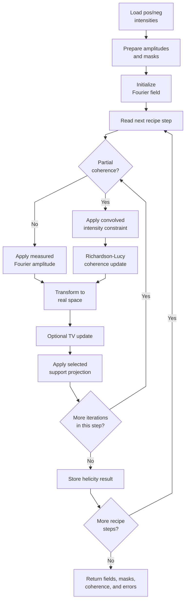
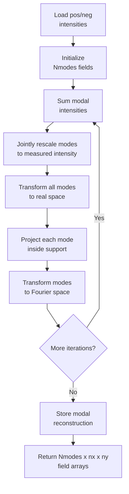
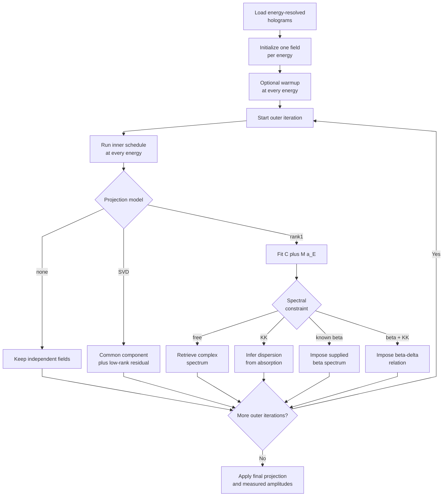
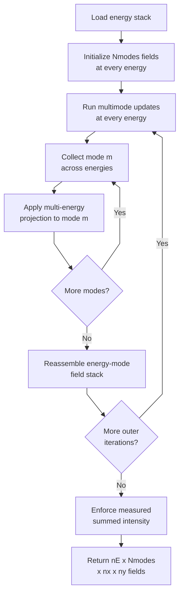
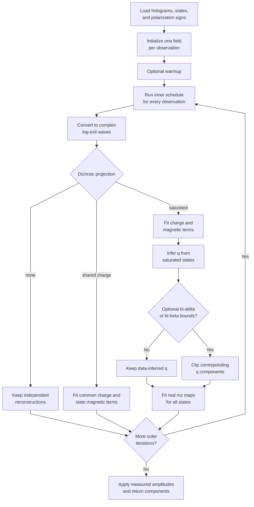

# Phase-Retrieval Libraries

This page describes the theory, implementation, and main usage of:

- `phase_retrieval_core.py`
- `phase_retrieval_core_multimode.py`
- `phase_retrieval_core_multienergy.py`
- `phase_retrieval_core_multienergy_multimode.py`
- `phase_retrieval_core_dichroic.py`

The examples focus on the reconstruction calls. Data preparation, centering,
support construction, and detector corrections are intentionally outside their
scope.

## 1. Shared Phase-Retrieval Model

For a coherent measurement, the detector records an intensity

$$
I(\mathbf q) = \left|\Psi(\mathbf q)\right|^2,
$$

but not the Fourier phase of $\Psi$. Phase retrieval alternates between two
constraint spaces:

1. In Fourier space, replace the amplitude at measured pixels by $\sqrt{I}$.
2. Transform to real space and apply a support-based projection.
3. Transform back and repeat.

The available real-space algorithms include ER, HAPRE, RAAR, HIO, SF, OSS,
CHIO, and HPR. Their feedback parameter is generated from `beta_zero` and
`beta_mode`.

An optional total-variation step is controlled by:

```python
alpha_zero
alpha_mode
TV_freq
```

`alpha_zero=0` disables TV descent. Partial-coherence reconstruction is
available in the base and multimode recipe drivers through Richardson-Lucy
updates of the mutual-coherence estimate.

### Array conventions

Measured holograms are intensities. The low-level kernels receive their square
root as `diffract`.

`mask_pixel` and the internally generated `bsmask` follow this convention:

```text
0       measured pixel, enforce the Fourier amplitude
nonzero unconstrained/invalid Fourier pixel
```

Zero measured intensity remains a valid constraint unless explicitly masked.

The reconstruction functions return Fourier-domain complex fields in the
convention used internally by `PhaseRtrv_core`. In the multi-energy libraries,
the corresponding real-space complex log-exit-wave is obtained by:

```python
L = fourier_field_to_object_log(fields)
```

and converted back with:

```python
fields = object_log_to_fourier_field(L)
```

The complex log representation is

$$
L(\mathbf r)
= \log\!\left|O(\mathbf r)\right|
+ i\,\arg O(\mathbf r),
$$

where $O(\mathbf r)$ is the sample exit wave.

## 2. Base Library

File: `library/phase_retrieval_core.py`

### Purpose

This is the standard single-mode, two-hologram implementation. The inputs are
named `pos` and `neg`, but the base algorithm does not impose a physical
relationship between their reconstructed objects. It runs a user-defined
sequence of independent reconstruction steps and permits one result to
initialize the next.

The main entry points are:

```python
default_phase_retrieval_recipe()
phase_retrieval_algorithm(...)
PhaseRtrv_core(...)
plot_phase_retrieval_errors(...)
```

### Flowchart



### Recipe structure

Every list index defines one complete reconstruction step:

```python
recipe = {
    "algorithm_list": ["HAPRE", "ER", "ER"],
    "number_iterations": [700, 50, 50],
    "helicity": ["pos", "pos", "neg"],
    "beta_zero": [0.5, 0.5, 0.5],
    "beta_mode": ["arctan", "const", "const"],
    "alpha_zero": [0.0, 0.0, 0.0],
    "alpha_mode": ["const", "const", "const"],
    "TV_freqs": [1e9, 1e9, 1e9],
    "RL_its": [0, 0, 0],
    "RL_freqs": [1e9, 1e9, 1e9],
    "plot_every": [350, 25, 25],
    "average_img": [30, 30, 30],
    "Fourier_last": [True, True, True],
    "Startimage": [None, "pos", "pos"],
    "Startgamma": [None, None, None],
}
```

`Startimage` may be `None`, an explicit array, `"pos"`, or `"neg"`. Reusing the
other hologram's reconstruction applies a masked amplitude normalization before
the next step.

Richardson-Lucy partial coherence is active when:

```text
RL_its[i] > 0 and RL_freqs[i] <= number_iterations[i].
```

### Usage

```python
from library import phase_retrieval_core as pr

recipe = pr.default_phase_retrieval_recipe()
recipe.update({
    "algorithm_list": ["HAPRE", "ER", "ER"],
    "number_iterations": [700, 50, 50],
    "helicity": ["pos", "pos", "neg"],
})

(
    retrieved_pos,
    retrieved_neg,
    retrieved_pos_partial,
    retrieved_neg_partial,
    bsmask_pos,
    bsmask_neg,
    gamma_pos,
    gamma_neg,
    errors,
) = pr.phase_retrieval_algorithm(
    pos_hologram,
    neg_hologram,
    mask_pixel,
    supportmask,
    phase_retrieval_recipe=recipe,
)
```

## 3. Multimode Library

File: `library/phase_retrieval_core_multimode.py`

### Theory

An incoherent modal mixture produces

$$
I(\mathbf q)
= \sum_m \left|\Psi_m(\mathbf q)\right|^2.
$$

The modes do not interfere. The Fourier constraint rescales all modes by a
common factor so their summed intensity matches the measurement. Real-space
support projections are then applied to each mode independently.

This model can absorb partial spatial coherence or other incoherent field
components, but modal decompositions have gauge freedom: degenerate modes may
rotate or exchange order without changing the measured intensity.

### Compatibility

With:

```python
"Nmodes": 1
```

the library reproduces the single-mode API. For multiple modes, reconstructed
fields have shape:

```text
(Nmodes, nx, ny)
```

while measured holograms remain two-dimensional.

### Flowchart



### Usage

```python
from library import phase_retrieval_core_multimode as pr_multi

recipe = pr_multi.default_phase_retrieval_recipe()
recipe.update({
    "Nmodes": 3,
    "algorithm_list": ["HAPRE", "ER"],
    "number_iterations": [700, 50],
    "helicity": ["pos", "pos"],
})

results = pr_multi.phase_retrieval_algorithm(
    pos_hologram,
    neg_hologram,
    mask_pixel,
    supportmask,
    phase_retrieval_recipe=recipe,
)

retrieved_pos = results[0]  # shape (3, nx, ny)
```

The measured-amplitude consistency check is:

```python
reconstructed_amplitude = np.sqrt(
    np.sum(np.abs(retrieved_pos) ** 2, axis=0)
)
```

## 4. Multi-Energy Library

File: `library/phase_retrieval_core_multienergy.py`

### Alternating reconstruction

Input holograms have shape:

```text
(nE, nx, ny)
```

The driver performs:

1. An optional independent warmup schedule at every energy.
2. The full inner update schedule at every energy.
3. A projection that couples the reconstructed exit waves across energy.
4. Repetition for `outer_iterations`.

The output remains a stack of Fourier fields with shape `(nE, nx, ny)`.

### Flowchart



### Staged update recipes

The inner schedule uses parallel scalar-or-list settings:

```python
recipe = {
    "inner_mode": ["HAPRE", "ER"],
    "inner_Nit": [700, 50],
    "beta_zero": [0.5, 0.9],
    "beta_mode": ["arctan", "const"],
    "alpha_zero": [0.0, 0.0],
    "alpha_mode": ["const", "const"],
    "TV_freq": [1e9, 1e9],
}
```

This executes 700 HAPRE iterations and then 50 ER iterations for each energy
during every outer iteration. Scalars are broadcast to all stages.

Warmup is configured independently:

```python
recipe.update({
    "warmup_mode": ["HAPRE", "ER"],
    "warmup_Nit": [700, 50],
})
```

Set `"warmup_Nit": 0` to disable it. The optional `warmup_beta_zero`,
`warmup_beta_mode`, `warmup_alpha_zero`, `warmup_alpha_mode`, and
`warmup_TV_freq` keys override inherited inner controls.

### Projection models

#### No coupling

```python
"projection_model": "none"
```

The energy channels are reconstructed independently.

#### SVD low rank

$$
L_E(\mathbf r) = C(\mathbf r) + \Delta_E(\mathbf r),
\qquad
\operatorname{rank}_E(\Delta) \le K.
$$

Use:

```python
"projection_model": "svd"
"rank": K
```

This is flexible and does not require a known spectral line shape.

#### Explicit rank-one spectrum

$$
L_E(\mathbf r) = C(\mathbf r) + M(\mathbf r)\,a_E.
$$

Use:

```python
"projection_model": "rank1_spectral"
```

$C(\mathbf r)$ is energy independent, $M(\mathbf r)$ is the spatial map of the
energy-dependent component, and $a_E$ is its complex spectrum.

Available spectral constraints are:

```text
free            retrieve both parts of a_E
kk              retrieve absorption-like part and calculate dispersion
known_beta      impose supplied beta(E), retain retrieved dispersion
known_beta_kk   impose beta(E) and supplied or KK-calculated delta(E)
```

`known_beta_spectrum` means the imaginary part `beta(E)` of the refractive
index, not raw absorption data. Convert measured absorption to beta and extend
or KK-transform it beforehand with `library/kramers_kronig.py`.

`absorption_part` specifies whether the absorption-like component occupies the
real or imaginary part of the fitted coefficient `a_E`. It is a factorization
convention and should be kept consistent between reconstruction and analysis.

### Usage

```python
from library import phase_retrieval_core_multienergy as pr_energy

recipe = {
    "inner_mode": ["HAPRE", "ER"],
    "inner_Nit": [700, 50],
    "outer_iterations": 100,
    "warmup_Nit": 0,
    "projection_model": "rank1_spectral",
    "spectral_constraint": "known_beta_kk",
    "energy_values": energies_eV,
    "known_beta_spectrum": beta_spectrum,
    "known_delta_spectrum": delta_spectrum,
    "projection_relaxation": 1.0,
}

fields, components, bsmasks, errors = (
    pr_energy.multi_energy_phase_retrieval_algorithm(
        holograms,
        mask_pixel,
        supportmask,
        multi_energy_recipe=recipe,
    )
)
```

Important outputs include:

```python
components["static_log_object"]
components["spectral_spatial_map"]
components["spectral_coefficients"]
```

## 5. Multi-Energy Multimode Library

File: `library/phase_retrieval_core_multienergy_multimode.py`

This combines the incoherent modal Fourier constraint with the multi-energy
object projection.

Fields have shape:

```text
(nE, Nmodes, nx, ny)
```

or `(nE, nx, ny)` when `Nmodes=1`.

The multi-energy projection is applied independently to each mode:

```text
mode 0 across all energies
mode 1 across all energies
...
```

Consequently, mode indices must remain physically corresponding across energy.
The code preserves mode order during updates, but it cannot identify arbitrary
mode permutations or unitary mixing between degenerate modes.

### Flowchart



### Usage

```python
from library import phase_retrieval_core_multienergy_multimode as pr_em

recipe = {
    "Nmodes": 3,
    "mode_initialization_seed": 0,
    "inner_mode": ["HAPRE", "ER"],
    "inner_Nit": [700, 50],
    "outer_iterations": 100,
    "warmup_Nit": 0,
    "projection_model": "svd",
    "rank": 1,
}

fields, components, bsmasks, errors = (
    pr_em.multi_energy_phase_retrieval_algorithm(
        holograms,
        mask_pixel,
        supportmask,
        multi_energy_recipe=recipe,
    )
)
```

Per-mode projection results are available in:

```python
components["mode_components"]
```

The measured intensity is reconstructed from:

```python
intensity = np.sum(np.abs(fields) ** 2, axis=1)
```

## 6. Dichroic Multi-State Library

File: `library/phase_retrieval_core_dichroic.py`

### General model

For observation `j`, magnetic state `s(j)`, and polarization coefficient `p_j`,
the shared-charge model is:

$$
L_j(\mathbf r)
= C(\mathbf r)
+ p_j M_{s(j)}(\mathbf r).
$$

`state_labels[j]` identifies the sample state, while
`polarization_signs[j]` is normally `+1` or `-1`. These names deliberately
separate sample state from helicity.

### Flowchart



### Shared-charge projection

```python
"projection_model": "shared_charge"
```

This fits a common complex charge log-object and an unconstrained complex
magnetic log-object for every state. The weighted linear system is solved
pixel-by-pixel in vectorized form.

The observation design must have full column rank. For example, these
observations are identifiable:

```python
state_labels = ["A", "A", "B", "C"]
polarization_signs = [+1, -1, +1, +1]
```

The paired observations of state A anchor the charge component, allowing the
single-polarization B and C magnetic components to be separated.

However, a single `+/-` pair is always exactly expressible as its complex mean
and difference. Therefore, `shared_charge` alone does not regularize that
two-image problem.

### Saturated-reference projection

```python
"projection_model": "saturated_reference"
```

This estimates the magnetic response from the reconstructed saturated state and
then enforces:

$$
L_j(\mathbf r)
= C(\mathbf r)
+ p_j q(\mathbf r)m_{z,s(j)}(\mathbf r),
$$

where $q(\mathbf r)$ is inferred from the data and $m_z$ is real. With

$$
n_m = -(\delta_m+i\beta_m)m_z,
\qquad
\phi = \phi_c\exp(-ikt\,n_m),
$$

the inferred unit-magnetization log response is:

$$
q = ikt(\delta_m+i\beta_m)
  = -kt\beta_m + i\,kt\delta_m.
$$

The user does not need to supply $\delta_m$, $\beta_m$, thickness, or $q$.
Instead, the user flags at least one state with known saturated magnetization:

```python
saturated_states = ["saturated_up"]  # interpreted as mz=+1

# Explicit signs are also supported:
saturated_states = {
    "saturated_up": +1,
    "saturated_down": -1,
}
```

Supplying `saturated_states` to the reconstruction driver automatically selects
the saturated-reference projection unless `projection_model` is explicitly
overridden.

The reconstruction returns:

```python
components["magnetic_response"]
components["magnetic_log_attenuation"]  # -real(q) = k*t*beta_m
components["magnetic_phase_shift"]      #  imag(q) = k*t*delta_m
components["magnetization_by_state"]
```

These are the dimensionless refractive-index-thickness products measured by
the exit wave. Even though `k` is known from the illumination energy, the
holograms determine only:

$$
kt\delta_m
\qquad\text{and}\qquad
kt\beta_m.
$$

They cannot determine $t$, $\delta_m$, and $\beta_m$ independently. Absolute
$\delta_m$ and $\beta_m$ require an independently known sample thickness:

$$
\delta_m
= \frac{\text{magnetic phase shift}}{kt},
\qquad
\beta_m
= \frac{\text{magnetic log attenuation}}{kt}.
$$

Without independently known $t$, the retrieval cannot distinguish refractive
index from thickness.

### Optional product ranges

The default recipe is exclusively data driven and contains no required
refractive-index prior:

```python
{
    "kt_delta_m_range": None,
    "kt_beta_m_range": None,
}
```

If approximate ranges for the observable products are available, they may be
imposed directly inside the joint projection:

```python
recipe = {
    "kt_delta_m_range": (kt_delta_min, kt_delta_max),
    "kt_beta_m_range": (kt_beta_min, kt_beta_max),
}
```

These dimensionless bounds map directly to the inferred complex response:

$$
\operatorname{Im}(q) \in \texttt{kt\_delta\_m\_range},
\qquad
-\operatorname{Re}(q) \in \texttt{kt\_beta\_m\_range}.
$$

The projection clips the two components independently before refitting the
real magnetization maps. This gives a conservative rectangular constraint in
complex response space. `projection_relaxation` controls how strongly the
bounded projection is mixed into the current reconstruction.

The returned diagnostics distinguish the raw and constrained estimates:

```python
components["magnetic_response_unconstrained"]
components["magnetic_response"]
components["physical_response_bounds_applied"]
components["response_bounds"]
```

Either range may be supplied independently. For example, to constrain only the
magnetic attenuation product:

```python
recipe = {
    "kt_beta_m_range": (0.01, 0.02),
}
```

This constrains attenuation while leaving the magnetic phase shift data driven.
If both entries remain `None`, no such constraint is applied.

### Opposite-polarization pair

```python
from library import phase_retrieval_core_dichroic as pr_dichroic

recipe = {
    "inner_mode": ["HAPRE", "ER"],
    "inner_Nit": [700, 50],
    "outer_iterations": 100,
    "warmup_Nit": 0,

    # Optional; omit both entries for a data-only reconstruction.
    "kt_delta_m_range": (kt_delta_min, kt_delta_max),
    "kt_beta_m_range": (kt_beta_min, kt_beta_max),
}

fields, components, bsmasks, errors = (
    pr_dichroic.dichroic_phase_retrieval_algorithm(
        np.stack([hologram_pos, hologram_neg]),
        mask_pixel,
        supportmask,
        state_labels=["state_A", "state_A"],
        polarization_signs=[+1, -1],
        saturated_states=["state_A"],
        dichroic_recipe=recipe,
    )
)

mz = components["magnetization_by_state"]["state_A"]
charge = components["charge_log_object"]
response = components["magnetic_response"]
```

Mark a state as saturated only when its magnetization is known to be uniformly
`+1` or `-1`. A non-saturated opposite-polarization pair can still be
reconstructed with `shared_charge`, but it cannot establish the absolute
magnetization scale.

### Multiple states

```python
recipe = {
    "inner_mode": ["HAPRE", "ER"],
    "inner_Nit": [700, 50],
}

fields, components, bsmasks, errors = (
    pr_dichroic.dichroic_phase_retrieval_algorithm(
        np.stack([
            hologram_saturated_pos,
            hologram_saturated_neg,
            hologram_domains_pos,
        ]),
        mask_pixel,
        supportmask,
        state_labels=["saturated", "saturated", "domains"],
        polarization_signs=[+1, -1, +1],
        saturated_states=["saturated"],
        dichroic_recipe=recipe,
    )
)

mz_domains = components["magnetization_by_state"]["domains"]
```

The opposite-polarization saturated pair anchors the shared charge and complex
magnetic response. Additional states may then be supplied with only one
polarization.

### Identifiability limitation

A same-polarization domain image plus a same-polarization saturated image is
not sufficient by itself:

```python
state_labels = ["domains", "saturated"]
polarization_signs = [+1, +1]
```

Marking the second state as saturated fixes `mz=1`, but the data still permit a
joint offset/scale transformation between charge and magnetic response. The
library rejects this rank-deficient geometry instead of returning an arbitrary
decomposition. At least one opposite-polarization partner, or another
independent physical normalization, is required.

## 7. Choosing a Library

| Data/model | Library |
|---|---|
| Two standard coherent holograms | `phase_retrieval_core` |
| Two holograms with incoherent modes | `phase_retrieval_core_multimode` |
| Energy stack with shared spectral structure | `phase_retrieval_core_multienergy` |
| Energy stack with incoherent modes | `phase_retrieval_core_multienergy_multimode` |
| Multiple magnetic states or helicities with shared charge | `phase_retrieval_core_dichroic` |

Start with the simplest model supported by the data. Increasing rank, mode
count, or the number of unconstrained state components increases flexibility
but also increases gauge freedom and the risk of unstable decompositions.

## 8. Practical Checks

Before interpreting a reconstruction:

1. Confirm that measured Fourier amplitudes are recovered outside `bsmask`.
2. Compare several random starts or initialization seeds.
3. Inspect error histories and joint-projection residuals.
4. Test stability against support changes.
5. For multimode fits, inspect modal intensity fractions and mode mixing.
6. For multi-energy fits, inspect singular values or fitted spectra.
7. For dichroic fits, check `identifiable`, design rank, and fit residuals.
8. Treat phase unwrapping and complex-log branch choices carefully.

The physical projections improve stability only when their assumptions match
the experiment. A numerically excellent constrained fit can still be biased by
incorrect spectral data, polarization signs, response-product bounds, magnetic
response, or state labels.
