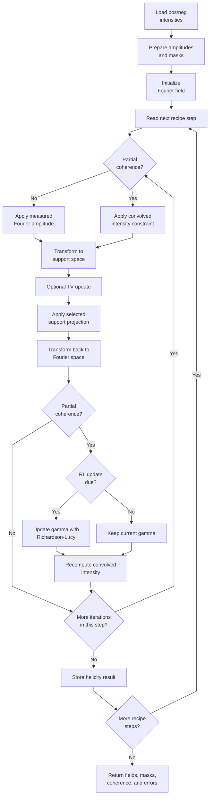
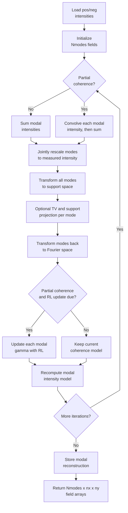
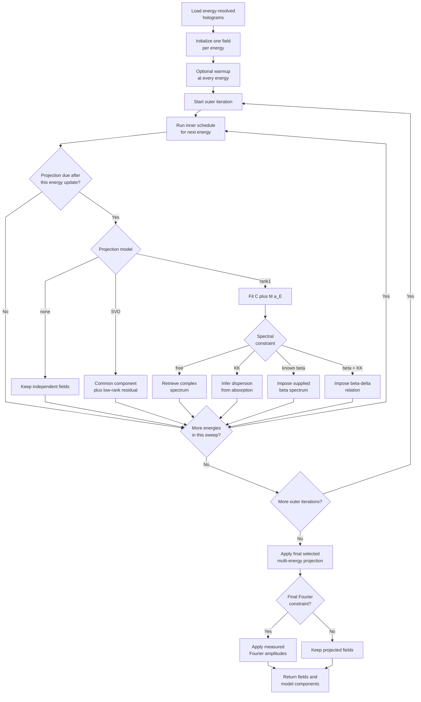
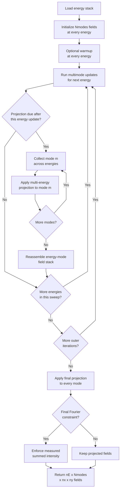
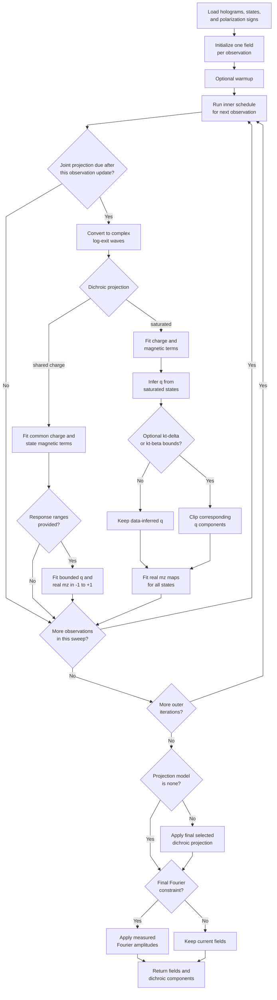
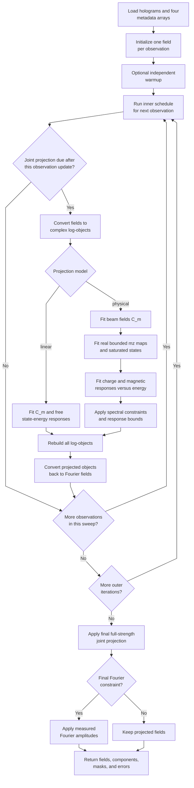

# Phase-Retrieval Libraries

This page describes the theory, implementation, and main usage of:

- `phase_retrieval_core.py`
- `phase_retrieval_core_multimode.py`
- `phase_retrieval_core_multienergy.py`
- `phase_retrieval_core_multienergy_multimode.py`
- `phase_retrieval_core_dichroic.py`
- `phase_retrieval_core_general.py`

The examples focus on the reconstruction calls. Data preparation, centering,
support construction, and detector corrections are intentionally outside their
scope.

## 1. Shared Phase-Retrieval Model

For a coherent measurement, the detector records an intensity

$$
I(\mathbf q)=|\Psi(\mathbf q)|^2.
$$

but not the Fourier phase of $\Psi$. Phase retrieval alternates between two
constraint spaces:

1. In Fourier space, replace the amplitude at measured pixels by $\sqrt{I}$.
2. Transform to real space and apply a support-based projection.
3. Transform back and repeat.

The available real-space algorithms include ER, HAPRE, RAAR, HIO, SF, OSS,
CHIO, and HPR. Their feedback parameter is generated from `beta_zero` and
`beta_mode`.

An optional total-variation step is controlled by:

```python
alpha_zero
alpha_mode
TV_freq
```

`alpha_zero=0` disables TV descent. Partial-coherence reconstruction is
available in the base and multimode recipe drivers through Richardson-Lucy
updates of the mutual-coherence estimate.

### Array conventions

Measured holograms are intensities. The low-level kernels receive their square
root as `diffract`.

`mask_pixel` and the internally generated `bsmask` follow this convention:

```text
0       measured pixel, enforce the Fourier amplitude
nonzero unconstrained/invalid Fourier pixel
```

Zero measured intensity remains a valid constraint unless explicitly masked.

The reconstruction functions return Fourier-domain complex fields in the
convention used internally by `PhaseRtrv_core`. In the multi-energy libraries,
the corresponding real-space complex log-exit-wave is obtained by:

```python
L = fourier_field_to_object_log(fields)
```

and converted back with:

```python
fields = object_log_to_fourier_field(L)
```

The complex log representation is

$$
L(\mathbf r)=\log|O(\mathbf r)|+i\arg O(\mathbf r).
$$

where $O(\mathbf r)$ is the sample exit wave.

## 2. Base Library

File: `library/phase_retrieval_core.py`

### Purpose

This is the standard single-mode, two-hologram implementation. The inputs are
named `pos` and `neg`, but the base algorithm does not impose a physical
relationship between their reconstructed objects. It runs a user-defined
sequence of independent reconstruction steps and permits one result to
initialize the next.

The main entry points are:

```python
default_phase_retrieval_recipe()
phase_retrieval_algorithm(...)
PhaseRtrv_core(...)
plot_phase_retrieval_errors(...)
```

### Flowchart



The Richardson-Lucy update is therefore **after** the support projection and
the transform back to Fourier space. It is not applied directly after the
Fourier-intensity correction. In the implementation, `gamma` is updated only
when partial coherence is active and the zero-based iteration index satisfies
`s > RL_freq` and `s % RL_freq == 0`. The convolved intensity is then
recomputed from the updated Fourier field and kernel for the next iteration.

### Recipe structure

Every list index defines one complete reconstruction step:

```python
recipe = {
    "algorithm_list": ["HAPRE", "ER", "ER"],
    "number_iterations": [700, 50, 50],
    "helicity": ["pos", "pos", "neg"],
    "beta_zero": [0.5, 0.5, 0.5],
    "beta_mode": ["arctan", "const", "const"],
    "alpha_zero": [0.0, 0.0, 0.0],
    "alpha_mode": ["const", "const", "const"],
    "TV_freqs": [1e9, 1e9, 1e9],
    "RL_its": [0, 0, 0],
    "RL_freqs": [1e9, 1e9, 1e9],
    "plot_every": [350, 25, 25],
    "average_img": [30, 30, 30],
    "Fourier_last": [True, True, True],
    "Startimage": [None, "pos", "pos"],
    "Startgamma": [None, None, None],
}
```

`Startimage` may be `None`, an explicit array, `"pos"`, or `"neg"`. Reusing the
other hologram's reconstruction applies a masked amplitude normalization before
the next step.

Richardson-Lucy partial coherence is active when:

```text
RL_its[i] > 0 and RL_freqs[i] <= number_iterations[i].
```

### Base recipe reference

This table applies to `phase_retrieval_core.phase_retrieval_algorithm()`.
Except for `hologram_intensity_cutoff_vmin`, every default below is a list with
one value per reconstruction step. All step-wise lists must have the same
length.

| Recipe key | Default | Meaning |
|---|---|---|
| `algorithm_list` | `["HAPRE", "ER", "ER", "HAPRE", "ER", "ER"]` | Real-space projection algorithm used by each step. |
| `number_iterations` | `[700, 50, 50, 700, 50, 50]` | Number of iterations in each step. |
| `helicity` | `["pos", "pos", "neg", "pos", "pos", "neg"]` | Selects the positive or negative input hologram for each step. |
| `beta_zero` | `[0.5, 0.5, 0.5, 0.5, 0.5, 0.5]` | Initial or constant feedback parameter for each projection step. |
| `beta_mode` | `["arctan", "const", "const", "arctan", "const", "const"]` | Feedback schedule used to generate beta during each step. |
| `alpha_zero` | `[0, 0, 0, 0, 0, 0]` | Total-variation descent strength. Zero disables TV descent. |
| `alpha_mode` | `["const", "const", "const", "const", "const", "const"]` | Schedule used to generate the TV strength. |
| `RL_its` | `[0, 0, 0, 50, 50, 50]` | Richardson-Lucy iterations per coherence update. Zero selects full coherence. |
| `RL_freqs` | `[1e9, 1e9, 1e9, 20, 20, 20]` | Interval between Richardson-Lucy updates. Values larger than the step length disable them. |
| `TV_freqs` | `[1e9, 1e9, 1e9, 1e9, 1e9, 1e9]` | Interval between TV updates. A very large value effectively disables repeated TV updates. |
| `plot_every` | `[349, 24, 24, 349, 24, 24]` | Error-sampling and optional plotting interval passed to the core. |
| `average_img` | `[30, 30, 30, 30, 30, 30]` | Number of low-error late iterations averaged for the returned field. |
| `Fourier_last` | `[True, True, True, True, True, True]` | If true, return the result in the Fourier-field convention. |
| `hologram_intensity_cutoff_vmin` | `-1` | Lower-percentile background subtraction. A negative value disables subtraction. |
| `Startimage` | `[None, "pos", "pos", "pos", "pos", "pos"]` | Starting field for each step: default support start, explicit array, or latest `pos`/`neg` result. |
| `Startgamma` | `[None, None, None, None, "pos", "pos"]` | Starting mutual-coherence estimate: default, explicit array, or latest `pos`/`neg` estimate. |

### Usage

```python
from library import phase_retrieval_core as pr

recipe = pr.default_phase_retrieval_recipe()
recipe.update({
    "algorithm_list": ["HAPRE", "ER", "ER"],
    "number_iterations": [700, 50, 50],
    "helicity": ["pos", "pos", "neg"],
})

(
    retrieved_pos,
    retrieved_neg,
    retrieved_pos_partial,
    retrieved_neg_partial,
    bsmask_pos,
    bsmask_neg,
    gamma_pos,
    gamma_neg,
    errors,
) = pr.phase_retrieval_algorithm(
    pos_hologram,
    neg_hologram,
    mask_pixel,
    supportmask,
    phase_retrieval_recipe=recipe,
)
```

## 3. Multimode Library

File: `library/phase_retrieval_core_multimode.py`

### Theory

An incoherent modal mixture produces

$$
I(\mathbf q)=\sum_m|\Psi_m(\mathbf q)|^2.
$$

The modes do not interfere. The Fourier constraint rescales all modes by a
common factor so their summed intensity matches the measurement. Real-space
support projections are then applied to each mode independently.

This model can absorb partial spatial coherence or other incoherent field
components, but modal decompositions have gauge freedom: degenerate modes may
rotate or exchange order without changing the measured intensity.

### Compatibility

With:

```python
"Nmodes": 1
```

the library reproduces the single-mode API. For multiple modes, reconstructed
fields have shape:

```text
(Nmodes, nx, ny)
```

while measured holograms remain two-dimensional.

### Multimode recipe reference

`phase_retrieval_core_multimode.phase_retrieval_algorithm()` accepts every key
in the [base recipe table](#base-recipe-reference), with the same defaults and
meaning, plus:

| Recipe key | Default | Meaning |
|---|---|---|
| `Nmodes` | `1` | Number of mutually incoherent modes. `1` reproduces single-mode phase retrieval. |

For `Nmodes > 1`, a two-dimensional `Startimage` is copied to every mode. A
three-dimensional start may instead provide one field per mode.

### Flowchart



### Usage

```python
from library import phase_retrieval_core_multimode as pr_multi

recipe = pr_multi.default_phase_retrieval_recipe()
recipe.update({
    "Nmodes": 3,
    "algorithm_list": ["HAPRE", "ER"],
    "number_iterations": [700, 50],
    "helicity": ["pos", "pos"],
})

results = pr_multi.phase_retrieval_algorithm(
    pos_hologram,
    neg_hologram,
    mask_pixel,
    supportmask,
    phase_retrieval_recipe=recipe,
)

retrieved_pos = results[0]  # shape (3, nx, ny)
```

The measured-amplitude consistency check is:

```python
reconstructed_amplitude = np.sqrt(
    np.sum(np.abs(retrieved_pos) ** 2, axis=0)
)
```

## 4. Multi-Energy Library

File: `library/phase_retrieval_core_multienergy.py`

### Alternating reconstruction

Input holograms have shape:

```text
(nE, nx, ny)
```

The driver performs:

1. An optional independent warmup schedule at every energy.
2. The full inner update schedule for one energy.
3. An optional projection that couples all reconstructed exit waves.
4. Repetition for `outer_iterations`.

The output remains a stack of Fourier fields with shape `(nE, nx, ny)`.
`projection_every` counts completed energy updates. Its default, `None`,
resolves to the number of energies, preserving one projection per complete
sweep. Set it to `1` to project after every energy update.
`projection_start` uses the same completed-update count. Its default, `None`,
resolves to the effective `projection_every` value, so projection first becomes
eligible at the first cadence boundary.

### Flowchart



### Staged update recipes

The inner schedule uses parallel scalar-or-list settings:

```python
recipe = {
    "inner_mode": ["HAPRE", "ER"],
    "inner_Nit": [700, 50],
    "beta_zero": [0.5, 0.9],
    "beta_mode": ["arctan", "const"],
    "alpha_zero": [0.0, 0.0],
    "alpha_mode": ["const", "const"],
    "TV_freq": [1e9, 1e9],
}
```

This executes 700 HAPRE iterations and then 50 ER iterations for each energy
during every outer iteration. Scalars are broadcast to all stages.

Warmup is configured independently:

```python
recipe.update({
    "warmup_mode": ["HAPRE", "ER"],
    "warmup_Nit": [700, 50],
})
```

Set `"warmup_Nit": 0` to disable it. The optional `warmup_beta_zero`,
`warmup_beta_mode`, `warmup_alpha_zero`, `warmup_alpha_mode`, and
`warmup_TV_freq` keys override inherited inner controls.

### Multi-energy recipe reference

This table applies to
`phase_retrieval_core_multienergy.multi_energy_phase_retrieval_algorithm()`.
The ordinary two-helicity `phase_retrieval_algorithm()` also exposed by that
module uses the base recipe table instead.

Stage controls such as `beta_zero` may be scalars, which are broadcast to every
stage, or lists matching the corresponding mode/iteration schedule.

#### Update schedule and numerical controls

| Recipe key | Default | Meaning |
|---|---|---|
| `inner_mode` | `["HAPRE", "ER"]` | Ordered phase-retrieval algorithms run at every energy during each outer iteration. |
| `inner_Nit` | `[700, 50]` | Iteration count for each inner stage. |
| `outer_iterations` | `100` | Number of cycles containing all energy updates and the joint projection. |
| `warmup_mode` | `["HAPRE", "ER"]` | Independent algorithms run once at every energy before joint iterations. |
| `warmup_Nit` | `[700, 50]` | Warmup iterations per stage. Set to `0` to disable warmup. |
| `shuffle_energies` | `True` | Randomize energy update order during each outer iteration. |
| `random_seed` | `None` | Seed used for energy shuffling. `None` uses nondeterministic initialization. |
| `beta_zero` | `0.5` | Inner-stage feedback strength; scalar or one value per inner stage. |
| `beta_mode` | `"arctan"` | Inner-stage beta schedule; scalar or one value per inner stage. |
| `alpha_zero` | `0.0` | Inner-stage TV strength. Zero disables TV descent. |
| `alpha_mode` | `"const"` | Inner-stage alpha schedule. |
| `TV_freq` | `1e9` | Inner-stage interval between TV updates. |
| `warmup_beta_zero` | `None` | Warmup beta strength. `None` inherits `beta_zero`. |
| `warmup_beta_mode` | `None` | Warmup beta schedule. `None` inherits `beta_mode`. |
| `warmup_alpha_zero` | `None` | Warmup TV strength. `None` inherits `alpha_zero`. |
| `warmup_alpha_mode` | `None` | Warmup alpha schedule. `None` inherits `alpha_mode`. |
| `warmup_TV_freq` | `None` | Warmup TV interval. `None` inherits `TV_freq`. |
| `plot_every` | `1e9` | Error-sampling and optional plotting interval passed to each core call. |
| `average_img` | `1` | Number of low-error late iterations averaged within each stage. |
| `Fourier_last` | `True` | Return each stage in the Fourier-field convention. |
| `final_fourier_constraint` | `True` | Reapply measured amplitudes after the final cross-energy projection. |
| `hologram_intensity_cutoff_vmin` | `-1` | Lower-percentile background subtraction per energy. Negative disables it. |

#### Cross-energy projection

| Recipe key | Default | Meaning |
|---|---|---|
| `projection_model` | `"svd"` | Cross-energy model: `"none"`, `"svd"`, or `"rank1_spectral"`. |
| `rank` | `1` | Rank retained by the SVD residual projection. Ignored by the other models. |
| `projection_every` | `None` | Number of completed energy updates between projections. `None` means the number of energies, or once per complete sweep. |
| `projection_relaxation` | `1.0` | Mixing strength between current and projected log-objects. |
| `projection_start` | `None` | Completed energy-update count at which coupling first becomes eligible. `None` resolves to the effective `projection_every` value. |
| `projection_constraints_inside_support_only` | `False` | Apply SVD or rank-one spectral projections only inside `supportmask` after shifting it to the log-object frame. |
| `projection_static_mode` | `"mean"` | Static component: weighted energy mean, first channel, or none. |
| `energy_weights` | `None` | Optional positive weight per energy used by projection fits. |
| `log_floor` | `1e-12` | Minimum object amplitude before taking the complex logarithm. |

#### Rank-one spectral constraints

These settings are used only when `projection_model="rank1_spectral"`, except
that harmless defaults may remain present for other models.

| Recipe key | Default | Meaning |
|---|---|---|
| `spectral_constraint` | `"free"` | Spectrum mode: `"free"`, `"kk"`, `"known_beta"`, or `"known_beta_kk"`. |
| `energy_values` | `None` | One photon energy per hologram; required for KK calculations. |
| `known_beta_spectrum` | `None` | Known imaginary refractive-index spectrum used by known-beta constraints. |
| `known_delta_spectrum` | `None` | Optional known real refractive-index spectrum for `known_beta_kk`. |
| `absorption_part` | `"real"` | Places the absorption-like coefficient in the real or imaginary part of the fitted spectrum. |
| `kk_sign` | `1.0` | Sign convention multiplying the KK-calculated dispersion. |
| `kk_subtract_baseline` | `True` | Subtract the absorption endpoint average before the finite-window KK transform. |
| `kk_normalize_input` | `False` | Normalize absorption before KK calculation. |
| `known_beta_normalization` | `"none"` | Optional normalization of supplied beta: none, max-absolute, L2, or standard deviation. |
| `fit_known_beta_scale` | `True` | Fit the scale relating supplied beta to the retrieved spectral coefficient. |
| `fit_known_beta_offset` | `True` | Fit an additive offset for the supplied beta spectrum. |

### Projection models

#### No coupling

```python
"projection_model": "none"
```

The energy channels are reconstructed independently.

#### SVD low rank

$$
L_E(\mathbf r) = C(\mathbf r) + \Delta_E(\mathbf r),
\qquad
\mathrm{rank}_E(\Delta) \le K.
$$

Use:

```python
{
    "projection_model": "svd",
    "rank": K,
    "projection_static_mode": "mean",
    "energy_weights": None,
    "projection_relaxation": 1.0,
}
```

This is a data-driven coupling between the energy channels. It assumes that,
after removing an energy-independent component, the energy-dependent changes
can be represented by only a few spatial-spectral components. It does not
require a known absorption spectrum, a KK relation, or a prescribed line
shape.

##### Matrix representation

After each energy has undergone its independent phase-retrieval updates, the
Fourier fields are converted to complex real-space log-objects. Each
two-dimensional image is flattened, and the energy channels are placed in the
columns of a matrix $\mathbf L\in\mathbb C^{P\times n_E}$ defined by:

$$
L_{pE}=L_E(\mathbf r_p),
\qquad
p=1,\ldots,P,
\qquad
E=1,\ldots,n_E.
$$

where $P=n_xn_y$ is the number of pixels. A row therefore contains the energy
dependence of one pixel, while a column contains the reconstructed log-object
at one energy.

The static component $\mathbf C\in\mathbb C^P$ is estimated according to
`projection_static_mode`:

- `"mean"`: weighted mean across energy, which is the default.
- `"first"`: use the first energy channel as the static reference.
- `"none"`: do not remove a static component.

For the default weighted mean,

$$
C(\mathbf r_p)=\frac{\sum_E w_E L_E(\mathbf r_p)}{\sum_E w_E}.
$$

The residual matrix is then

$$
\boldsymbol\Delta=\mathbf L-\mathbf C\mathbf 1^{\mathsf T}.
$$

##### Weighted truncated SVD

If `energy_weights` are provided, the code normalizes them to have unit mean
and defines a diagonal weight matrix $\mathbf W^{1/2}$. Its diagonal entries
are:

$$
(\mathbf W^{1/2})_{EE}=\sqrt{w_E}.
$$

All off-diagonal entries are zero.

The weighted residual is:

$$
\boldsymbol\Delta_w=\boldsymbol\Delta\mathbf W^{1/2}.
$$

Consequently, channels with larger weights influence the low-rank fit more
strongly. The code requires every weight to be finite and strictly positive.

It then calculates:

$$
\boldsymbol\Delta_w=\mathbf U\boldsymbol\Sigma\mathbf V^\dagger.
$$

Only the first $K$ singular components are retained:

$$
\boldsymbol\Delta_{w,K}=\mathbf U_K\boldsymbol\Sigma_K\mathbf V_K^\dagger.
$$

This is the best rank-$K$ approximation to the weighted residual in the
least-squares Frobenius norm. The code then removes the weighting and restores
the static component:

$$
\boldsymbol\Delta_K=\boldsymbol\Delta_{w,K}\mathbf W^{-1/2},
\qquad
\mathbf L_{\mathrm{SVD}}=\mathbf C\mathbf 1^{\mathsf T}+\boldsymbol\Delta_K.
$$

Finally, `projection_relaxation` mixes the projected and unprojected
log-objects:

$$
\mathbf L_{\mathrm{new}}=(1-\lambda)\mathbf L+\lambda\mathbf L_{\mathrm{SVD}},
\qquad 0\le\lambda\le1.
$$

Here $\lambda$ is `projection_relaxation`. A value of `1.0` applies the full
projection; smaller values impose the common structure more gradually.

The projected log-objects are exponentiated and transformed back to the
Fourier-field convention before the next phase-retrieval iteration.

##### Meaning of the rank

The retained SVD terms can be written as

$$
\Delta_E(\mathbf r)
\approx
\sum_{k=1}^{K} M_k(\mathbf r)a_{k,E}.
$$

Each term contains:

- a complex spatial map $M_k(\mathbf r)$;
- a complex energy-dependent coefficient $a_{k,E}$.

Therefore:

- `rank=0` keeps only the energy-independent component.
- `rank=1` permits one dominant energy-dependent spatial pattern.
- `rank=2` permits two independently varying spectral-spatial patterns.
- Larger ranks approach independent reconstruction of every energy.

The implementation caps the effective rank at the number of energy channels.
Once the requested rank is large enough to retain the full residual matrix,
the SVD step no longer removes any residual component.

The decomposition is empirical. Individual SVD components are not guaranteed
to equal particular chemical species or physical mechanisms. Their ordering is
set by explained weighted variance, and components with similar singular
values may rotate within their shared subspace.

Because $\mathbf L$ is complex, the SVD treats absorption-like and phase-like
variations jointly. It does not perform one SVD for the real part and another
for the imaginary part. A retained component may therefore contain correlated
changes in both exit-wave amplitude and phase.

The split between the static component and the residual is also a convention.
For example, with `"mean"`, any energy-independent part of a resonant signal is
absorbed into $C(\mathbf r)$. The complete projected stack is meaningful, but
the individual static and SVD components should not automatically be assigned
a unique physical interpretation.

##### Why it improves multi-energy retrieval

Independent phase retrieval gives every energy channel enough freedom to
develop unrelated phase errors, stagnation artefacts, branch choices, and
noise. In a real energy scan, however, most object structure is shared:

- the support and sample geometry are common;
- the nonresonant charge contribution changes slowly or remains nearly fixed;
- resonant changes usually occupy only a small number of spatial regions and
  spectral line shapes;
- detector noise and algorithmic artefacts are less likely to be correlated
  across all energies.

The low-rank projection keeps variations that recur coherently across the
energy stack and suppresses channel-specific variations that require many
singular components. Information from strong or high-signal channels therefore
helps stabilize weak channels. Repeating the independent Fourier constraints
and the joint low-rank projection alternates between consistency with the
measured data and consistency with the shared sample model.

This is useful only when the low-rank assumption is approximately correct. A
rank that is too small can erase genuine spectral structure or force different
materials into the same component. A rank that is too large provides little
regularization. Inspect:

```python
components["singular_values"]
components["static_log_object"]
components["energy_dependent_log_object"]
```

A practical starting point is to compare reconstructions over several ranks
and look for a stable result whose discarded singular values form a lower,
noise-like tail.

Before interpreting that spectrum, make sure that:

- all energies are spatially registered to the same pixels;
- the support describes the same object region at every energy;
- Fourier-field normalization is reasonably consistent across the stack;
- complex-log phases use compatible branches.

A subpixel drift produces derivative-like components and increases the apparent
rank. Likewise, unrelated $2\pi$ phase wraps can dominate the singular values.
The SVD projection can reduce random inconsistencies, but it cannot determine
whether a large variation is physical, a registration error, or a phase-branch
error.

A complete SVD recipe can look like:

```python
recipe = {
    "inner_mode": ["HAPRE", "ER"],
    "inner_Nit": [700, 50],
    "outer_iterations": 100,
    "warmup_Nit": 0,
    "projection_model": "svd",
    "rank": 1,
    "projection_static_mode": "mean",
    "energy_weights": np.ones(len(energies_eV)),
    "projection_relaxation": 0.5,
}
```

For a first test, equal weights and a relaxation between `0.3` and `1.0` are
reasonable numerical choices. They are not universal physical defaults:
rank, weights, and relaxation should be checked against reconstruction
stability and preservation of known spectral features.

##### SVD projection sequence

```mermaid
%%{init: {"flowchart": {"nodeSpacing": 16, "rankSpacing": 22, "curve": "linear"}, "themeVariables": {"fontSize": "14px"}}}%%
flowchart LR
    A[Fourier fields<br/>at all energies] --> B[Convert to complex<br/>log-objects]
    B --> C[Flatten images into<br/>pixels x energies]
    C --> D[Estimate and subtract<br/>static component]
    D --> E[Apply square-root<br/>energy weights]
    E --> F[Compute SVD]
    F --> G[Keep first K<br/>components]
    G --> H[Undo weighting and<br/>restore static part]
    H --> I[Relax toward<br/>projected stack]
    I --> J[Convert back to<br/>Fourier fields]
```



#### Explicit rank-one spectrum

$$
L_E(\mathbf r) = C(\mathbf r) + M(\mathbf r)\,a_E.
$$

Use:

```python
"projection_model": "rank1_spectral"
```

$C(\mathbf r)$ is energy independent, $M(\mathbf r)$ is the spatial map of the
energy-dependent component, and $a_E$ is its complex spectrum.

Available spectral constraints are:

```text
free            retrieve both parts of a_E
kk              retrieve absorption-like part and calculate dispersion
known_beta      impose supplied beta(E), retain retrieved dispersion
known_beta_kk   impose beta(E) and supplied or KK-calculated delta(E)
```

`known_beta_spectrum` means the imaginary part `beta(E)` of the refractive
index, not raw absorption data. Convert measured absorption to beta and extend
or KK-transform it beforehand with `library/kramers_kronig.py`.

`absorption_part` specifies whether the absorption-like component occupies the
real or imaginary part of the fitted coefficient `a_E`. It is a factorization
convention and should be kept consistent between reconstruction and analysis.

### Usage

```python
from library import phase_retrieval_core_multienergy as pr_energy

recipe = {
    "inner_mode": ["HAPRE", "ER"],
    "inner_Nit": [700, 50],
    "outer_iterations": 100,
    "warmup_Nit": 0,
    "projection_model": "rank1_spectral",
    "spectral_constraint": "known_beta_kk",
    "energy_values": energies_eV,
    "known_beta_spectrum": beta_spectrum,
    "known_delta_spectrum": delta_spectrum,
    "projection_relaxation": 1.0,
}

fields, components, bsmasks, errors = (
    pr_energy.multi_energy_phase_retrieval_algorithm(
        holograms,
        mask_pixel,
        supportmask,
        multi_energy_recipe=recipe,
    )
)
```

Important outputs include:

```python
components["static_log_object"]
components["spectral_spatial_map"]
components["spectral_coefficients"]
```

## 5. Multi-Energy Multimode Library

File: `library/phase_retrieval_core_multienergy_multimode.py`

This combines the incoherent modal Fourier constraint with the multi-energy
object projection.

Fields have shape:

```text
(nE, Nmodes, nx, ny)
```

or `(nE, nx, ny)` when `Nmodes=1`.

The multi-energy projection is applied independently to each mode:

```text
mode 0 across all energies
mode 1 across all energies
...
```

Consequently, mode indices must remain physically corresponding across energy.
The code preserves mode order during updates, but it cannot identify arbitrary
mode permutations or unitary mixing between degenerate modes.

### Multi-energy multimode recipe reference

`phase_retrieval_core_multienergy_multimode.multi_energy_phase_retrieval_algorithm()`
accepts every key in the multi-energy recipe tables above, with identical
defaults and meaning, plus:

| Recipe key | Default | Meaning |
|---|---|---|
| `Nmodes` | `1` | Number of mutually incoherent modes reconstructed at every energy. |
| `mode_initialization_seed` | `0` | Random seed used to create nondegenerate initial modes. May be `None`. |

The cross-energy projection is applied separately to each mode using the same
`projection_model`, rank, weights, and spectral settings.
The ordinary `phase_retrieval_algorithm()` exposed by this combined module uses
the multimode recipe table instead.

### Flowchart



### Usage

```python
from library import phase_retrieval_core_multienergy_multimode as pr_em

recipe = {
    "Nmodes": 3,
    "mode_initialization_seed": 0,
    "inner_mode": ["HAPRE", "ER"],
    "inner_Nit": [700, 50],
    "outer_iterations": 100,
    "warmup_Nit": 0,
    "projection_model": "svd",
    "rank": 1,
}

fields, components, bsmasks, errors = (
    pr_em.multi_energy_phase_retrieval_algorithm(
        holograms,
        mask_pixel,
        supportmask,
        multi_energy_recipe=recipe,
    )
)
```

Per-mode projection results are available in:

```python
components["mode_components"]
```

The measured intensity is reconstructed from:

```python
intensity = np.sum(np.abs(fields) ** 2, axis=1)
```

## 6. Dichroic Multi-State Library

File: `library/phase_retrieval_core_dichroic.py`

### General model

For observation `j`, magnetic state `s(j)`, and polarization coefficient `p_j`,
the shared-charge model is:

$$
L_j(\mathbf r)=C(\mathbf r)+p_jM_{s(j)}(\mathbf r).
$$

`state_labels[j]` identifies the sample state, while
`polarization_signs[j]` is normally `+1` or `-1`. These names deliberately
separate sample state from helicity.

### Dichroic recipe reference

These tables apply to
`phase_retrieval_core_dichroic.dichroic_phase_retrieval_algorithm()`.

#### Observation updates

| Recipe key | Default | Meaning |
|---|---|---|
| `inner_mode` | `["HAPRE"]` | Ordered phase-retrieval algorithms run for each observation during every outer iteration. |
| `inner_Nit` | `[1]` | Iteration count for each inner stage. |
| `outer_iterations` | `300` | Number of observation-update and dichroic-projection cycles. |
| `warmup_mode` | `["HAPRE"]` | Independent algorithm schedule run once before joint iterations. |
| `warmup_Nit` | `[20]` | Warmup iterations per stage. Set to `0` to disable warmup. |
| `shuffle_observations` | `True` | Randomize observation order in each outer iteration. |
| `random_seed` | `None` | Seed used for observation shuffling. |
| `beta_zero` | `0.5` | Inner-stage feedback strength; scalar or one value per inner stage. |
| `beta_mode` | `"arctan"` | Inner-stage beta schedule. |
| `alpha_zero` | `0.0` | Inner-stage TV strength. Zero disables TV descent. |
| `alpha_mode` | `"const"` | Inner-stage alpha schedule. |
| `TV_freq` | `1e9` | Inner-stage interval between TV updates. |
| `warmup_beta_zero` | `None` | Warmup beta strength. `None` inherits `beta_zero`. |
| `warmup_beta_mode` | `None` | Warmup beta schedule. `None` inherits `beta_mode`. |
| `warmup_alpha_zero` | `None` | Warmup TV strength. `None` inherits `alpha_zero`. |
| `warmup_alpha_mode` | `None` | Warmup alpha schedule. `None` inherits `alpha_mode`. |
| `warmup_TV_freq` | `None` | Warmup TV interval. `None` inherits `TV_freq`. |
| `plot_every` | `1e9` | Error-sampling and optional plotting interval passed to each core call. |
| `average_img` | `1` | Number of low-error late iterations averaged within each stage. |
| `Fourier_last` | `True` | Return each stage in the Fourier-field convention. |
| `final_fourier_constraint` | `True` | Reapply every hologram's measured amplitudes after the final projection. |
| `hologram_intensity_cutoff_vmin` | `-1` | Lower-percentile background subtraction per hologram. Negative disables it. |

#### Dichroic projection

| Recipe key | Default | Meaning |
|---|---|---|
| `projection_model` | `"shared_charge"` | Coupling model: `"none"`, `"shared_charge"`, or `"saturated_reference"`. |
| `projection_every` | `None` | Number of completed observation updates between projections. `None` means the number of holograms, or once per complete sweep. |
| `projection_start` | `None` | Completed observation-update count at which projection first becomes eligible. `None` resolves to the effective `projection_every` value. |
| `projection_relaxation` | `1.0` | Mixing strength between current and dichroically projected fields. |
| `observation_weights` | `None` | Optional positive least-squares weight for each hologram. |
| `rank_deficient` | `"error"` | Reject nonidentifiable designs, or use `"minimum_norm"` for an arbitrary pseudoinverse gauge. |
| `saturated_states` | `None` | Sequence interpreted as saturated `+1` states, or dictionary mapping state labels to `+1`/`-1`. |
| `clip_magnetization` | `True` | Enforce the reduced-magnetization interval `[-1, 1]` in saturated-reference fits. Set `False` only for diagnostic unconstrained fits. |
| `zero_magnetization_outside_support` | `False` | Force fitted real magnetization maps to zero outside `supportmask` after shifting it to the log-object frame. |
| `projection_constraints_inside_support_only` | `False` | Apply dichroic projections only inside `supportmask` after shifting it to the log-object frame. |
| `physical_constraints_inside_support_only` | `False` | Backward-compatible alias for `projection_constraints_inside_support_only`. |
| `kt_delta_m_range` | `None` | Optional lower/upper bounds for `k*t*delta_m`, used by `"shared_charge"` and `"saturated_reference"`. |
| `kt_beta_m_range` | `None` | Optional lower/upper bounds for `k*t*beta_m`, used by `"shared_charge"` and `"saturated_reference"`. |
| `log_floor` | `1e-12` | Minimum object amplitude before taking the complex logarithm. |

### Flowchart



### Shared-charge projection

```python
"projection_model": "shared_charge"
```

This fits a common complex charge log-object and an unconstrained complex
magnetic log-object for every state. The weighted linear system is solved
pixel-by-pixel in vectorized form.

#### Relation to low-rank/SVD coupling

The same low-dimensional idea that motivates the multi-energy SVD also applies
to multiple magnetic states. If every reconstructed state were independent,
each image could acquire a different charge background, phase offset, or
reconstruction artefact. The physical model instead says that all observations
are generated from a smaller collection of latent images:

$$
L_j(\mathbf r)=C(\mathbf r)+p_jM_{s(j)}(\mathbf r).
$$

For $n_s$ magnetic states, the observation stack is therefore generated by at
most $1+n_s$ complex spatial components: one shared charge component and one
magnetic component per state. In matrix form:

$$
\mathbf L=\mathbf X\mathbf A^{\mathsf T}.
$$

where:

- $\mathbf L\in\mathbb C^{P\times n_{\mathrm{obs}}}$ contains flattened
  log-objects;
- $\mathbf X\in\mathbb C^{P\times(1+n_s)}$ contains the unknown charge and
  state magnetic maps;
- $\mathbf A\in\mathbb R^{n_{\mathrm{obs}}\times(1+n_s)}$ is fixed by
  `state_labels` and `polarization_signs`.

The first column of $\mathbf A$ is one. Observation $j$ has
$p_j$ in the column corresponding to state $s(j)$ and zero in the other state
columns. The code solves this linear model by weighted least squares at every
pixel and rebuilds all observations from the fitted shared components.

#### Identifiability of the shared-charge model

For $S$ distinct magnetic states, the unknown latent images are:

$$
C(\mathbf r),\ M_1(\mathbf r),\ldots,M_S(\mathbf r).
$$

There are therefore $S+1$ unknown complex values at each pixel. Observation
$j$, belonging to state $s(j)$, contributes a design-matrix row whose first
entry is one, whose entry for state $s(j)$ is $p_j$, and whose other
state entries are zero. Equivalently:

$$
A_{j0}=1,
\qquad
A_{j,s(j)}=p_j.
$$

All other state entries in row $j$ are zero.

The decomposition is unique only when:

$$
\mathrm{rank}(\mathbf A)=S+1.
$$

For the state-specific design used by this library, this has a simple practical
interpretation:

1. Every state must appear in at least one observation.
2. At least one state must be observed with two distinct polarization
   coefficients, normally $+1$ and $-1$.
3. At least $S+1$ total observations are required.

The paired state fixes the common charge component. Once $C(\mathbf r)$ is
anchored, a single-polarization observation of another state is sufficient to
determine that state's unconstrained complex magnetic term:

$$
M_s(\mathbf r)=\frac{L_j(\mathbf r)-C(\mathbf r)}{p_j}.
$$

The state carrying the opposite-polarization pair can be any state. It does not
have to be saturated. Conversely, simply observing many states does not help
if every state is seen at only one polarization: the charge can still be
shifted while compensating all magnetic terms.

The following configurations summarize the requirement:

| Measurements | Identifiable by `shared_charge`? | Reason |
|---|---:|---|
| One state at $+1$ and $-1$ | Yes | Two observations determine $C$ and one $M_s$. |
| $S$ states; one state at both signs, every other state at one sign | Yes | This is the minimum $S+1$-observation design. |
| Every state at both signs | Yes | Overdetermined and usually better conditioned. |
| One observation per state, all at the same sign | No | No observation anchors the charge/magnetic separation. |
| Domain state and saturated state, both only at $+1$ | No | Saturation metadata does not repair the rank-deficient first-stage fit in the current implementation. |

The code calculates and returns:

```python
components["design_matrix"]
components["design_rank"]
components["design_condition_number"]
components["identifiable"]
```

`design_rank == S + 1` establishes algebraic uniqueness. It does not guarantee
good numerical conditioning. A large `design_condition_number` means that
small reconstruction errors can produce large changes in the separated charge
and magnetic maps. Balanced $+1/-1$ measurements and repeated observations
generally improve conditioning.

The minimum design is not automatically a strong regularizer. For example, a
single state measured once at each polarization gives two equations for two
complex unknowns:

$$
C = \frac{L_+ + L_-}{2},
\qquad
M = \frac{L_+ - L_-}{2}.
$$

Every pair of reconstructed images can be represented this way, so the
`shared_charge` projection has no residual to reject. Stability improves when
the system is overdetermined, when several observations share the same latent
components, or when the stronger saturated-reference model is valid.

Without response ranges, `shared_charge` retrieves only a separate complex
magnetic term for each state:

$$
M_s(\mathbf r)=q(\mathbf r)m_{z,s}(\mathbf r).
$$

The physical condition $-1\le m_{z,s}\le1$ restricts this ambiguity but does
not normally select a unique scale. For example, the transformation

$$
q\longrightarrow a q,
\qquad
m_{z,s}\longrightarrow \frac{m_{z,s}}{a}
$$

leaves every $M_s$ unchanged whenever the rescaled magnetizations remain
inside `[-1, 1]`. Thus the unconstrained shared-charge result still does not
identify a unique $q$.

When `kt_delta_m_range` or `kt_beta_m_range` is supplied, the library uses the
additional physical condition $-1\le m_z\le1$. It alternates between fitting
real, clipped magnetization maps and fitting a common complex response $q$
inside the supplied component ranges. This produces a feasible bounded
factorization

$$
M_s(\mathbf r)\approx q(\mathbf r)m_{z,s}(\mathbf r),
\qquad -1\le m_{z,s}(\mathbf r)\le1.
$$

A saturated state is therefore not required to use response ranges. Without a
saturated anchor, however, multiple feasible factorizations can remain, so the
returned $q$ should be interpreted as a range-constrained solution rather than
a uniquely data-determined material response.

This is closely related to a low-rank projection because the observation
matrix is restricted to the column space of a small number of latent maps.
However, the current dichroic library does **not** calculate an unconstrained
SVD for this step. It uses the known state/polarization design matrix, which is
more informative:

- SVD would discover an arbitrary low-dimensional basis.
- The dichroic design matrix assigns the basis explicitly to charge and
  magnetic-state terms.
- Polarization reversal fixes the sign with which a magnetic term enters each
  observation.
- Saturated states can additionally fix the magnetization scale.

The advantage is the same as in multi-energy retrieval: information shared by
several measurements is pooled, while variations inconsistent with the joint
model are rejected. In particular:

- repeated observations constrain the same charge exit wave;
- opposite polarizations separate charge-like and magnetic-like terms;
- a well-constrained state can stabilize another state measured with lower
  signal;
- uncorrelated reconstruction artefacts are less likely to fit the prescribed
  state/polarization structure.

The restriction also creates an identifiability requirement. The columns of
$\mathbf A$ must be linearly independent. If they are not, multiple sets of
charge and magnetic maps reproduce exactly the same observations. The code
checks the design rank and rejects such a geometry by default.

The `saturated_reference` model imposes a still stronger pointwise
factorization:

$$
M_s(\mathbf r) = q(\mathbf r)m_{z,s}(\mathbf r),
$$

where the complex response $q(\mathbf r)$ is shared and each $m_{z,s}$ is real.
At each pixel, all state-dependent magnetic terms must therefore lie on the
same line in the complex plane, with real coefficients $m_{z,s}(\mathbf r)$.
This is not necessarily a global rank-one matrix across pixels and states,
because every state may have a different spatial magnetization map. Unlike a
generic SVD basis, the saturated observations provide the normalization and
complex direction of $q$, making the pointwise factors physically
interpretable when the model assumptions hold.

### Saturated-reference projection

```python
"projection_model": "saturated_reference"
```

This estimates the magnetic response from the reconstructed saturated state and
then enforces:

$$
L_j(\mathbf r)=C(\mathbf r)+p_jq(\mathbf r)m_{z,s(j)}(\mathbf r).
$$

where $q(\mathbf r)$ is inferred from the data and `m_z` is real. With

$$
n_m = -(\delta_m+i\beta_m)m_z,
\qquad
\phi = \phi_c\exp(-ikt\,n_m),
$$

the inferred unit-magnetization log response is:

$$
q = ikt(\delta_m+i\beta_m)
  = -kt\beta_m + i\,kt\delta_m.
$$

The user does not need to supply $\delta_m$, $\beta_m$, thickness, or $q$.
Instead, the user flags at least one state with known saturated magnetization:

```python
saturated_states = ["saturated_up"]  # interpreted as mz=+1

# Explicit signs are also supported:
saturated_states = {
    "saturated_up": +1,
    "saturated_down": -1,
}
```

Supplying `saturated_states` to the reconstruction driver automatically selects
the saturated-reference projection unless `projection_model` is explicitly
overridden.

#### How the saturated-reference projection works

The current implementation applies the constraint in two stages.

First, it performs the full-rank shared-charge fit:

$$
L_j(\mathbf r)=C(\mathbf r)+p_jM_{s(j)}(\mathbf r).
$$

This stage must already satisfy the design-rank conditions described above.
Marking a state as saturated does not bypass this requirement.

Second, for each saturated state $s$, whose magnetization is supplied as
$m_{z,s}^{\mathrm{sat}}=+1$ or $-1$, it forms a response estimate:

$$
q_s(\mathbf r)=\frac{M_s(\mathbf r)}{m_{z,s}^{\mathrm{sat}}}.
$$

With multiple saturated states, the current code averages these estimates:

$$
q(\mathbf r)=\frac{1}{N_{\mathrm{sat}}}\sum_{s\in\mathcal S_{\mathrm{sat}}}q_s(\mathbf r).
$$

Optional `kt_delta_m_range` and `kt_beta_m_range` bounds are then applied to
the imaginary and negative-real parts of $q$, respectively.

For every nonsaturated state, the closest real magnetization coefficient is
obtained by projecting its complex magnetic term onto the complex direction
defined by $q$:

$$
m_{z,s}(\mathbf r)=\frac{\Re[q^*(\mathbf r)M_s(\mathbf r)]}{|q(\mathbf r)|^2}.
$$

This is a real least-squares fit of
$M_s(\mathbf r)\approx q(\mathbf r)m_{z,s}(\mathbf r)$. If
`clip_magnetization=True`, the result is additionally clipped to
$[-1,1]$. At pixels where $\lvert q\rvert$ is numerically zero, the code cannot
determine a magnetization coefficient and returns zero.

The projected observations are finally rebuilt as:

$$
L_j^{\mathrm{proj}}(\mathbf r)=C(\mathbf r)+p_jq(\mathbf r)m_{z,s(j)}(\mathbf r).
$$

This real-`m_z` constraint is what gives the saturated-reference model more
stabilizing power than the unconstrained `shared_charge` model. Complex
state-dependent fluctuations that do not lie along the response direction
$q(\mathbf r)$ are rejected.

If `zero_magnetization_outside_support=True`, both `saturated_reference` and
the bounded `shared_charge` physical response fit multiply their real
magnetization maps by `supportmask != 0`. This is an effective observability
prior: magnetic material may still exist outside the holographic support, but
the reconstruction treats its retrievable magnetic contrast as zero there.
The option can improve convergence by preventing unsupported pixels from
absorbing arbitrary magnetic structure.

If `projection_constraints_inside_support_only=True`, the dichroic projection
is applied only inside `supportmask`. Outside the support, each observation's
current log object is kept unchanged, so charge, polarization, response, and
real-`m_z` constraints do not overwrite those pixels. The older key
`physical_constraints_inside_support_only` is accepted as an alias.

The high-level dichroic driver shifts `supportmask` into the same log-object
frame used by the projection before applying it to real magnetization maps.
Direct projection calls expect `magnetization_supportmask` and
`projection_supportmask` to already be in that frame.

#### Required number of states and holograms

Only one saturated state is mathematically required. More saturated states are
optional and provide multiple estimates of $q$, but they are useful only if
they genuinely share the same response.

The minimum configurations are:

| Goal | Minimum identifiable measurements |
|---|---|
| Estimate charge and the response of one saturated state | The saturated state measured at two distinct polarizations, normally $+1$ and $-1$: 2 holograms. |
| Reconstruct one nonsaturated state using one saturated reference | Two states and at least 3 holograms: one state measured at two polarizations, the other measured at least once, with either state flagged saturated. |
| Reconstruct $S-1$ nonsaturated states using a saturated reference | $S$ states and at least $S+1$ holograms: every state once, one state at a second polarization, and at least one of the $S$ states saturated. |
| Add redundancy and stronger noise rejection | Measure several or all states at both polarizations; for $S$ states this gives up to $2S$ holograms. |

For example, this three-hologram design is sufficient for a saturated state and
one domain state:

```python
state_labels = ["saturated", "saturated", "domains"]
polarization_signs = [+1, -1, +1]
saturated_states = {"saturated": +1}
```

The opposite-polarization pair determines $C$ and the saturated magnetic term.
The remaining observation determines the domain-state magnetic term, which is
then constrained to the real-`m_z` direction.

This alternative is also algebraically identifiable:

```python
state_labels = ["domains", "domains", "saturated"]
polarization_signs = [+1, -1, +1]
saturated_states = {"saturated": +1}
```

Here the domain pair anchors $C$, and the single saturated observation provides
$M_{\mathrm{sat}}$ once $C$ is known. The saturated state itself therefore does
not have to be the state measured at both polarizations.

By contrast, this is not sufficient for the current implementation:

```python
state_labels = ["domains", "saturated"]
polarization_signs = [+1, +1]
saturated_states = {"saturated": +1}
```

There are two observations but three unknown first-stage maps:
$C$, $M_{\mathrm{domains}}$, and $M_{\mathrm{sat}}$. The shared-charge design
is rank deficient, so the code rejects it even though one state is marked
saturated.

#### Physical conditions for validity

The algebraic rank condition is necessary but not sufficient. The
saturated-reference model also assumes:

1. **Common charge exit wave.** The nonmagnetic complex transmission
   $C(\mathbf r)$ must be the same for every state and polarization. Structural
   motion, changing illumination, damage, or charge-state changes violate this
   assumption.
2. **Known polarization coefficients.** The supplied signs must correctly
   describe the magnetic coupling. They are normally $+1$ and $-1$, and the
   convention must be used consistently.
3. **Common magnetic response.** The same complex $q(\mathbf r)$ must relate
   magnetization to the magnetic log-object in every state. This assumes the
   same photon energy, sample thickness distribution, composition, and magnetic
   optical constants across the state series.
4. **Real scalar magnetization.** State changes must be representable by a real
   out-of-plane factor `m_z(r)`. A changing complex response, additional
   magnetic components, or polarization-dependent nonmagnetic effects are not
   represented by this model.
5. **Correct saturation metadata.** A state marked `+1` or `-1` must have that
   known uniform magnetization over the reconstructed magnetic region. Partial
   saturation biases both $q$ and every subsequently retrieved `m_z` map.
6. **Spatial registration.** Corresponding pixels must represent the same
   sample location in all holograms. Drift is otherwise interpreted as a
   state-dependent magnetic signal.
7. **Compatible complex-log branches.** The reconstructed phases must use
   compatible branches. Unrelated $2\pi$ wraps violate the additive log-object
   equations.
8. **Nonzero response.** Magnetization is identifiable only where
   $\lvert q(\mathbf r)\rvert$ is sufficiently large compared with noise.

Multiple saturated states should produce mutually consistent estimates
$q_s(\mathbf r)$. Their disagreement is a useful model diagnostic: it can
indicate incomplete saturation, drift, state-dependent optical constants, or
phase-branch errors. The current implementation averages the estimates rather
than fitting separate responses.

#### Why the joint reconstruction can be more stable

The algorithm alternates between two different sources of information:

1. **Per-observation phase retrieval** enforces each hologram's measured
   Fourier amplitudes and the common real-space support.
2. **Dichroic projection** forces the reconstructed log-exit waves to share the
   same charge term and to follow the supplied state/polarization structure.

The Fourier data alone do not determine the phase uniquely, and independent
reconstructions may settle into different stagnation points. The dichroic
projection transfers information between observations:

- a polarization pair helps determine the charge term used by every state;
- repeated states constrain one magnetic map from several holograms;
- a saturated state determines the complex magnetic-response direction used
  to constrain all nonsaturated states;
- deviations that cannot be represented by the joint model are removed before
  the next Fourier-amplitude update.

This does not make phase retrieval convex and does not guarantee convergence to
the true object. The benefit depends on the joint model being more accurate
than the independent reconstruction errors. If the shared-charge or
shared-response assumptions are wrong, the same projection can force a
consistent but biased answer.

The amount of actual regularization also depends on the measurement design:

- A single nonsaturated state measured at $+1$ and $-1$ is identifiable under
  `shared_charge`, but every image pair has an exact mean/difference
  decomposition. The joint projection adds essentially no extra constraint.
- A single saturated state measured at both polarizations identifies $C$ and
  $q$, but contains no unknown magnetization state to stabilize.
- One saturated state plus at least one nonsaturated state lets the
  saturated-reference projection impose the real-`m_z` condition on the
  nonsaturated reconstruction. This is the smallest design that uses the
  saturated response to constrain an unknown state.
- Additional polarizations, repeated acquisitions, or additional states make
  the system overdetermined and allow the projection residual to reject noise
  and model-inconsistent reconstruction features.

Monitor the following diagnostics rather than relying only on the final image:

```python
components["identifiable"]
components["design_rank"]
components["design_condition_number"]
components["fit_residual_rms"]
components["magnetic_response_unconstrained"]
components["magnetic_response"]
```

A low residual is meaningful only together with a full-rank, reasonably
conditioned design and physically credible saturated-state assumptions.

The reconstruction returns:

```python
components["magnetic_response"]
components["magnetic_log_attenuation"]  # -real(q) = k*t*beta_m
components["magnetic_phase_shift"]      #  imag(q) = k*t*delta_m
components["magnetization_by_state"]
```

These are the dimensionless refractive-index-thickness products measured by
the exit wave. Even though `k` is known from the illumination energy, the
holograms determine only:

$$
kt\delta_m
\qquad,\qquad
kt\beta_m.
$$

They cannot determine $t$, $\delta_m$, and $\beta_m$ independently. Absolute
$\delta_m$ and $\beta_m$ require an independently known sample thickness:

Let $\Phi_m=\mathrm{Im}(q)$ denote the retrieved magnetic phase shift and
$A_m=-\mathrm{Re}(q)$ denote the retrieved magnetic log attenuation.
Then:

$$
\delta_m=\frac{\Phi_m}{kt},
\qquad
\beta_m=\frac{A_m}{kt}.
$$

Without independently known $t$, the retrieval cannot distinguish refractive
index from thickness.

### Optional product ranges

The default recipe is exclusively data driven and contains no required
refractive-index prior:

```python
{
    "kt_delta_m_range": None,
    "kt_beta_m_range": None,
}
```

If approximate ranges for the observable products are available, they may be
imposed in either joint projection:

```python
recipe = {
    "projection_model": "shared_charge",
    "kt_delta_m_range": (kt_delta_min, kt_delta_max),
    "kt_beta_m_range": (kt_beta_min, kt_beta_max),
}
```

In `shared_charge`, the ranges are combined with the universal reduced-
magnetization condition $-1\le m_z\le1$. In `saturated_reference`, the known
$m_z=+1$ or $-1$ state additionally fixes the response scale directly.

These dimensionless bounds map directly to the inferred complex response. If
the lower and upper values of `kt_delta_m_range` are denoted by
$d_{\min}$ and $d_{\max}$, and those of `kt_beta_m_range` by
$b_{\min}$ and $b_{\max}$, then:

$$
\mathrm{Im}(q) \in [d_{\min},d_{\max}],
\qquad
\mathrm{Re}(-q) \in [b_{\min},b_{\max}].
$$

The projection clips the two components independently before refitting the
real magnetization maps. This gives a conservative rectangular constraint in
complex response space. `projection_relaxation` controls how strongly the
bounded projection is mixed into the current reconstruction.

The returned diagnostics distinguish the raw and constrained estimates:

```python
components["magnetic_response_unconstrained"]
components["magnetic_response"]
components["physical_response_bounds_applied"]
components["response_bounds"]
```

Either range may be supplied independently. For example, to constrain only the
magnetic attenuation product:

```python
recipe = {
    "kt_beta_m_range": (0.01, 0.02),
}
```

This constrains attenuation while leaving the magnetic phase shift data driven.
If both entries remain `None`, no such constraint is applied.

### Opposite-polarization pair

```python
from library import phase_retrieval_core_dichroic as pr_dichroic

recipe = {
    "inner_mode": ["HAPRE", "ER"],
    "inner_Nit": [700, 50],
    "outer_iterations": 100,
    "warmup_Nit": 0,

    # Optional; omit both entries for a data-only reconstruction.
    "kt_delta_m_range": (kt_delta_min, kt_delta_max),
    "kt_beta_m_range": (kt_beta_min, kt_beta_max),
}

fields, components, bsmasks, errors = (
    pr_dichroic.dichroic_phase_retrieval_algorithm(
        np.stack([hologram_pos, hologram_neg]),
        mask_pixel,
        supportmask,
        state_labels=["state_A", "state_A"],
        polarization_signs=[+1, -1],
        saturated_states=["state_A"],
        dichroic_recipe=recipe,
    )
)

mz = components["magnetization_by_state"]["state_A"]
charge = components["charge_log_object"]
response = components["magnetic_response"]
```

Mark a state as saturated only when its magnetization is known to be uniformly
`+1` or `-1`. A non-saturated opposite-polarization pair can still be
reconstructed with `shared_charge`, but it cannot establish the absolute
magnetization scale.

### Multiple states

```python
recipe = {
    "inner_mode": ["HAPRE", "ER"],
    "inner_Nit": [700, 50],
}

fields, components, bsmasks, errors = (
    pr_dichroic.dichroic_phase_retrieval_algorithm(
        np.stack([
            hologram_saturated_pos,
            hologram_saturated_neg,
            hologram_domains_pos,
        ]),
        mask_pixel,
        supportmask,
        state_labels=["saturated", "saturated", "domains"],
        polarization_signs=[+1, -1, +1],
        saturated_states=["saturated"],
        dichroic_recipe=recipe,
    )
)

mz_domains = components["magnetization_by_state"]["domains"]
```

The opposite-polarization saturated pair anchors the shared charge and complex
magnetic response. Additional states may then be supplied with only one
polarization.

### Identifiability limitation

A same-polarization domain image plus a same-polarization saturated image is
not sufficient by itself:

```python
state_labels = ["domains", "saturated"]
polarization_signs = [+1, +1]
```

Marking the second state as saturated fixes `mz=1`, but the data still permit a
joint offset/scale transformation between charge and magnetic response. The
library rejects this rank-deficient geometry instead of returning an arbitrary
decomposition. At least one opposite-polarization partner, or another
independent physical normalization, is required.

## 7. General State/Energy/Polarization/Beam Library

File: `library/phase_retrieval_core_general.py`

### Observation metadata

Every hologram is assigned four pieces of metadata:

| Metadata | Physical role |
|---|---|
| `state_labels` | Selects the sample state $j$. |
| `energy_labels` | Selects an energy or any illumination category expected to change the material response. |
| `polarization_coefficients` | Multiplies the material response; normally $+1$ or $-1$. |
| `beam_labels` | Selects a beam condition that changes the common field but not the material response. |

For example, moving the beam gives a new `beam_label` while retaining the same
state, energy, and polarization metadata. Changing photon energy gives a new
`energy_label`. Reversing helicity normally changes only the polarization
coefficient from $+1$ to $-1$.

### Physical factorized model

The default `projection_model="physical_factorized"` uses the exit wave:

$$
\phi_a(\mathbf r)
=
\phi_{c,m(a)}(\mathbf r)
\exp\!\left[
-i\kappa_{e(a)}t\,n_{c,e(a)}
-p_a i\kappa_{e(a)}t\,n_{m,e(a)}
m_{z,s(a)}(\mathbf r)
\right].
$$

Here:

- $m(a)$ is the illumination/beam condition;
- $e(a)$ is the energy/response mode;
- $s(a)$ is the magnetic state;
- $p_a$ is the known polarization coefficient;
- $\phi_{c,m}$ is the common field for illumination mode $m$;
- $n_{c,e}$ is the charge refractive-index contribution at energy $e$;
- $n_{m,e}$ is the magnetic refractive-index contribution at energy $e$;
- $m_{z,s}(\mathbf r)$ is real and satisfies
  $-1\le m_{z,s}(\mathbf r)\le1$.

Beam condition does not index the charge or magnetic refractive indices.
Measurements made after moving the beam therefore share both energy responses.

If `zero_magnetization_outside_support=True`, the physical projection
multiplies each fitted `m_z` map by `supportmask != 0`. This can stabilize the
factorization when magnetic contrast outside the reconstructed support is
effectively unobservable and should not absorb residual model error.

If `projection_constraints_inside_support_only=True`, the selected general
projection is applied only inside `supportmask`. Outside the support, each
observation's current log object is kept unchanged, so beam, energy,
polarization, charge, magnetic-response, `m_z`, and flexible linear coupling
constraints do not overwrite those pixels. The older key
`physical_constraints_inside_support_only` is accepted as an alias.

The high-level general driver shifts `supportmask` into the same log-object
frame used by the projection before applying it to `m_z` or using it to limit
the projection. Direct projection calls expect `magnetization_supportmask` and
`projection_supportmask` to already be in that frame.

If one experimental change affects both the common illumination field and the
material response, change both labels. For example, if changing energy also
changes the incident wavefront significantly, use a new `energy_label` and a
new `beam_label` for that observation.

Define:

$$
L_a=\log\phi_a,
\qquad
C_m=\log\phi_{c,m},
\qquad
q_{c,e}=-i\kappa_e t\,n_{c,e},
\qquad
q_{m,e}=-i\kappa_e t\,n_{m,e}.
$$

The fitted model is:

$$
L_a(\mathbf r)
=
C_{m(a)}(\mathbf r)
+
q_{c,e(a)}
+
p_aq_{m,e(a)}m_{z,s(a)}(\mathbf r).
$$

This factorization is nonlinear because $q_{m,e}$ and $m_{z,s}$ are both
unknown. The code uses alternating projections:

1. Fit one complex common field $C_m(\mathbf r)$ per beam condition.
2. Fit real $m_{z,s}(\mathbf r)$ maps and clip them to `[-1, 1]`.
3. Hold saturated states at their supplied $+1$ or $-1$ values.
4. Fit scalar complex charge and magnetic responses at every energy.
5. Apply optional spectral constraints and response-value bounds.
6. Rebuild every observation from the constrained factors.

The number of alternating factorization updates is controlled by
`physical_iterations`.

### Meaning of the three illumination changes

#### Energy or response mode

Changing `energy_labels` selects another charge and magnetic response:

$$
q_{c,e_1}\ne q_{c,e_2},
\qquad
q_{m,e_1}\ne q_{m,e_2}
$$

in general. The label can also represent another illumination property that is
expected to change the material response in a way that is not a simple sign
inversion.

#### Polarization

Polarization enters through the supplied coefficient:

$$
L_+=C_b+R_{je},
\qquad
L_-=C_b-R_{je}
$$

for a purely magnetic shorthand. In the full model, the charge term is
unchanged and only the magnetic term changes sign:

$$
L_+=C_m+q_{c,e}+q_{m,e}m_z,
\qquad
L_-=C_m+q_{c,e}-q_{m,e}m_z.
$$

#### Beam condition

Changing beam position or wavefront selects another common field:

$$
L_{a_1}=C_{m_1}+q_{c,e}+p q_{m,e}m_z,
\qquad
L_{a_2}=C_{m_2}+q_{c,e}+p q_{m,e}m_z.
$$

The same charge response, magnetic response, and magnetization map are shared.

### Projection models

| Model | Meaning |
|---|---|
| `"physical_factorized"` | Default physical model with $C_m$, $q_{c,e}$, $q_{m,e}$, and bounded real $m_z$. |
| `"state_energy_beam"` | Flexible linear model $L=C_m+pR_{s,e}$ with one unrestricted complex response map per state-energy pair. |
| `"none"` | Independent phase retrieval without a joint projection. |

The linear model is useful for exploratory work and model checking. The
physical model is more restrictive and can improve stability when its
factorization matches the experiment.

### Linear-model identifiability

Let there be $B$ beam conditions and $Q$ observed `(state, energy)` response
pairs. At each pixel there are $B+Q$ unknown complex values. The design matrix
contains:

- one coefficient `1` in the column for the observation's beam condition;
- the value $p_a$ in the column for its state-energy response;
- zeros elsewhere.

For `state_energy_beam`, the decomposition is unique only when:

$$
\mathrm{rank}(\mathbf A)=B+Q.
$$

The default `rank_deficient="error"` rejects an acquisition geometry that
cannot uniquely separate beam and material terms. The returned diagnostics are:

```python
components["design_matrix"]
components["design_rank"]
components["design_condition_number"]
components["identifiable"]
```

A useful minimal anchor is one state-energy response measured at opposite
polarizations under the same beam:

$$
C_b=\frac{L_++L_-}{2},
\qquad
R_{je}=\frac{L_+-L_-}{2}.
$$

Once that response is known, observing it under another beam condition
determines the new $C_b$. Once a beam field is known, one observation of a new
state-energy pair determines its response. In practice, repeated and
overdetermined measurements are preferable because they improve conditioning
and let the projection reject inconsistent reconstruction artefacts.

Examples:

| Measurements | Identifiable? |
|---|---:|
| One state and energy, one beam, both polarizations | Yes |
| The above plus the same response under a moved beam | Yes |
| An anchored beam plus additional states or energies measured once | Yes |
| One unrelated state-energy response under each unrelated beam | No |
| All observations at one polarization with an unanchored connected design | Generally no |

`rank_deficient="minimum_norm"` permits a pseudoinverse result for exploratory
work, but the separated beam and response components then depend on an
arbitrary minimum-norm gauge.

### Physical-model identifiability

The physical factorization has two separate scale/gauge questions:

- An arbitrary constant complex offset can be transferred between all $C_m$
  and $q_{c,e}$. The implementation fixes this by setting the mean retrieved
  charge response to zero before optional constraints. Absolute charge values
  therefore require an external reference.
- The transformation $q_{m,e}\to a q_{m,e}$ and
  $m_{z,s}\to m_{z,s}/a$ leaves the magnetic product unchanged while the
  rescaled magnetization remains in `[-1, 1]`. Saturated states with known
  $m_z=+1$ or $-1$ anchor this magnetic scale.

Returned diagnostics include:

```python
components["magnetic_scale_anchored"]
components["charge_absolute_gauge_anchored"]
components["charge_gauge"]
```

The default is still data driven: `saturated_states=None` and all spectral and
value constraints set to `"free"` or `None`.

### Spectral constraints

Charge and magnetic responses have independent settings:

```python
"charge_spectral_constraint": "free"
"magnetic_spectral_constraint": "free"
```

Each accepts the same modes as the multi-energy rank-one projector:

| Mode | Action |
|---|---|
| `"free"` | Retrieve an arbitrary complex response at each energy. |
| `"kk"` | Retrieve the absorption-like component and calculate the dispersion-like component with Kramers-Kronig. |
| `"known_beta"` | Impose a supplied beta spectrum while retaining retrieved dispersion. |
| `"known_beta_kk"` | Impose supplied beta and supplied or KK-calculated delta. |

The corresponding inputs are:

```python
"energy_values"
"known_charge_beta_spectrum"
"known_charge_delta_spectrum"
"known_magnetic_beta_spectrum"
"known_magnetic_delta_spectrum"
"charge_absorption_part"
"magnetic_absorption_part"
```

As in the multi-energy library, supplied beta spectra must be imaginary
refractive-index spectra, not raw absorption measurements. Conversion and
spectral extension remain in `library/kramers_kronig.py`.

### Response-value bounds

Optional rectangular bounds can be imposed directly on the retrieved
dimensionless log responses:

```python
"charge_response_real_range": (minimum, maximum)
"charge_response_imag_range": (minimum, maximum)
"magnetic_response_real_range": (minimum, maximum)
"magnetic_response_imag_range": (minimum, maximum)
```

These constrain $q_{c,e}=-i\kappa_e t n_{c,e}$ and
$q_{m,e}=-i\kappa_e t n_{m,e}$. Bounds on $n_c$ or $n_m$ can be converted to
response bounds when $\kappa_e$ and thickness are independently known. The
code deliberately constrains the observable products rather than pretending
to recover refractive index and thickness separately.

### What is retrieved

The directly retrieved material quantity is:

$$
q_{c,e}=-i\kappa_e t\,n_{c,e},
\qquad
q_{m,e}=-i\kappa_e t\,n_{m,e}.
$$

Thickness and refractive index are not separated by diffraction data alone.
The main returned components are:

```python
components["common_exit_waves"]
components["common_log_objects_by_beam"]
components["charge_response"]
components["magnetic_response"]
components["magnetization_by_state"]
```

If thickness and wave numbers are independently known:

```python
n_m = general.response_to_refractive_index(
    components["magnetic_response"][:, None, None],
    wave_numbers=wave_numbers,
    thickness=thickness,
    response_energy_indices=np.arange(len(wave_numbers)),
)
```

The same helper can be used for `charge_response`. The order of wave numbers
must match `components["energy_names"]`.

### Flowchart



### Recipe reference

| Recipe key | Default | Meaning |
|---|---|---|
| `inner_mode` | `["HAPRE"]` | Ordered phase-retrieval algorithms run for every observation in each outer iteration. |
| `inner_Nit` | `[1]` | Iteration count for every inner stage. |
| `outer_iterations` | `300` | Number of independent-update and joint-projection cycles. |
| `warmup_mode` | `["HAPRE"]` | Independent algorithm schedule run before joint iterations. |
| `warmup_Nit` | `[20]` | Warmup iterations. Set to `0` to disable warmup. |
| `shuffle_observations` | `True` | Randomize observation order in each outer iteration. |
| `random_seed` | `None` | Seed for observation shuffling. |
| `beta_zero` | `0.5` | Feedback strength; scalar or one value per inner stage. |
| `beta_mode` | `"arctan"` | Feedback schedule. |
| `alpha_zero` | `0.0` | TV strength. Zero disables TV descent. |
| `alpha_mode` | `"const"` | TV-strength schedule. |
| `TV_freq` | `1e9` | Interval between TV updates. |
| `warmup_beta_zero` | `None` | Warmup feedback strength. `None` inherits `beta_zero`. |
| `warmup_beta_mode` | `None` | Warmup feedback schedule. |
| `warmup_alpha_zero` | `None` | Warmup TV strength. |
| `warmup_alpha_mode` | `None` | Warmup TV schedule. |
| `warmup_TV_freq` | `None` | Warmup TV interval. |
| `plot_every` | `1e9` | Error-sampling interval passed to each core call. |
| `average_img` | `1` | Number of low-error late iterations averaged in each stage. |
| `Fourier_last` | `True` | Keep stage outputs in the Fourier-field convention. |
| `final_fourier_constraint` | `True` | Reapply measured amplitudes after the final projection. |
| `hologram_intensity_cutoff_vmin` | `-1` | Optional low-percentile background subtraction. |
| `projection_model` | `"physical_factorized"` | Use `"physical_factorized"`, flexible `"state_energy_beam"`, or `"none"`. |
| `projection_every` | `None` | Number of completed observation updates between projections. `None` means the number of holograms, or once per complete sweep. |
| `projection_start` | `None` | Completed observation-update count at which projection first becomes eligible. `None` resolves to the effective `projection_every` value. |
| `projection_relaxation` | `1.0` | Mixing strength between current and projected fields. |
| `projection_constraints_inside_support_only` | `False` | Apply any joint projection only inside `supportmask` after shifting it to the log-object frame. |
| `observation_weights` | `None` | Optional positive weight for each hologram. |
| `rank_deficient` | `"error"` | Reject nonidentifiable designs, or use `"minimum_norm"` for an arbitrary gauge. |
| `physical_iterations` | `20` | Alternating factorization updates per joint projection. |
| `saturated_states` | `None` | Optional sequence of `+1` saturated states or mapping to `+1`/`-1`. |
| `zero_magnetization_outside_support` | `False` | Force fitted magnetization maps to zero outside `supportmask` after shifting it to the log-object frame. |
| `physical_constraints_inside_support_only` | `False` | Backward-compatible alias for `projection_constraints_inside_support_only`. |
| `charge_spectral_constraint` | `"free"` | Charge spectrum mode: free, KK, known beta, or known beta plus KK. |
| `magnetic_spectral_constraint` | `"free"` | Magnetic spectrum mode with the same choices. |
| `energy_values` | `None` | Numerical energy axis required by KK constraints. |
| `known_charge_beta_spectrum` | `None` | Optional known charge beta spectrum. |
| `known_charge_delta_spectrum` | `None` | Optional known charge delta spectrum. |
| `known_magnetic_beta_spectrum` | `None` | Optional known magnetic beta spectrum. |
| `known_magnetic_delta_spectrum` | `None` | Optional known magnetic delta spectrum. |
| `charge_absorption_part` | `"real"` | Complex-response component interpreted as charge absorption. |
| `magnetic_absorption_part` | `"real"` | Complex-response component interpreted as magnetic absorption. |
| `charge_response_real_range` | `None` | Optional real-component interval for the charge response. |
| `charge_response_imag_range` | `None` | Optional imaginary-component interval for the charge response. |
| `magnetic_response_real_range` | `None` | Optional real-component interval for the magnetic response. |
| `magnetic_response_imag_range` | `None` | Optional imaginary-component interval for the magnetic response. |
| `kk_sign` | `1.0` | Sign convention used for KK dispersion. |
| `kk_subtract_baseline` | `True` | Subtract the spectral endpoint baseline before KK. |
| `kk_normalize_input` | `False` | Normalize the retrieved absorption-like spectrum before KK. |
| `known_spectrum_normalization` | `"none"` | Normalization for supplied spectra. |
| `fit_known_spectrum_scale` | `True` | Fit scale between supplied and retrieved spectra. |
| `fit_known_spectrum_offset` | `True` | Fit an additive supplied-spectrum offset. |
| `log_floor` | `1e-12` | Minimum object amplitude before taking the complex logarithm. |

### Usage

```python
import numpy as np
from library import phase_retrieval_core_general as general

holograms = np.stack([
    hologram_A_E1_plus_beam1,
    hologram_A_E1_minus_beam1,
    hologram_A_E1_plus_beam2,
    hologram_B_E1_plus_beam1,
    hologram_A_E2_plus_beam1,
])

fields, components, bsmasks, errors = (
    general.general_phase_retrieval_algorithm(
        holograms,
        mask_pixel,
        supportmask,
        state_labels=["A", "A", "A", "B", "A"],
        energy_labels=["E1", "E1", "E1", "E1", "E2"],
        polarization_coefficients=[+1, -1, +1, +1, +1],
        beam_labels=["beam1", "beam1", "beam2", "beam1", "beam1"],
        saturated_states={"A": +1},
        general_recipe={
            "projection_model": "physical_factorized",
            "inner_mode": ["HAPRE", "ER"],
            "inner_Nit": [700, 50],
            "outer_iterations": 100,
            "warmup_Nit": 0,
            "projection_relaxation": 0.5,
            "magnetic_spectral_constraint": "free",
            "magnetic_response_real_range": (-0.05, -0.01),
        },
    )
)
```

In this example:

- the first two observations separate `beam1` from response `(A, E1)`;
- the third determines `beam2` while sharing the same `(A, E1)` response;
- the fourth adds response `(B, E1)`;
- the fifth adds the energy-dependent response `(A, E2)`.

## 8. Choosing a Library

| Data/model | Library |
|---|---|
| Two standard coherent holograms | `phase_retrieval_core` |
| Two holograms with incoherent modes | `phase_retrieval_core_multimode` |
| Energy stack with shared spectral structure | `phase_retrieval_core_multienergy` |
| Energy stack with incoherent modes | `phase_retrieval_core_multienergy_multimode` |
| Multiple magnetic states or helicities with shared charge | `phase_retrieval_core_dichroic` |
| States and energies measured across polarizations and beam conditions | `phase_retrieval_core_general` |

Start with the simplest model supported by the data. Increasing rank, mode
count, or the number of unconstrained state components increases flexibility
but also increases gauge freedom and the risk of unstable decompositions.

## 9. Practical Checks

Before interpreting a reconstruction:

1. Confirm that measured Fourier amplitudes are recovered outside `bsmask`.
2. Compare several random starts or initialization seeds.
3. Inspect error histories and joint-projection residuals.
4. Test stability against support changes.
5. For multimode fits, inspect modal intensity fractions and mode mixing.
6. For multi-energy fits, inspect singular values or fitted spectra.
7. For dichroic fits, check `identifiable`, design rank, and fit residuals.
8. For general fits, check design rank, conditioning, and whether beam,
   energy, and polarization metadata describe the experiment correctly.
9. Treat phase unwrapping and complex-log branch choices carefully.

The physical projections improve stability only when their assumptions match
the experiment. A numerically excellent constrained fit can still be biased by
incorrect spectral data, polarization signs, response-product bounds, magnetic
response, or state labels.
