# Universal Phase Retrieval

This document describes `library/phase_retrieval_universal.py` as a standalone
library. It covers the physical model, measurable quantities, input metadata,
projection choices, constraints, reconstruction loop, outputs, limitations,
and practical use.

## Standalone Architecture

`phase_retrieval_universal.py` is self-contained with respect to phase
retrieval. It does not import:

- `phase_retrieval_core.py`;
- `phase_retrieval_core_general.py`;
- `phase_retrieval_core_multienergy.py`;
- `phase_retrieval_core_multimode.py`;
- `phase_retrieval_core_dichroic.py`;
- any other phase-retrieval implementation in this repository.

The universal file contains its own copies of the required numerical
implementations:

- the Fourier/support phase-retrieval kernel;
- HAPRE, ER, HIO, RAAR, and the other update projections;
- beta and alpha schedules;
- optional Richardson-Lucy and total-variation updates;
- Fourier-field/log-object conversions;
- SVD and rank-one spectral projections;
- spectral constraints;
- metadata validation;
- physical state/energy/polarization/illumination factorization;
- complete reconstruction drivers.

The scientific `kramers_kronig.py` utility remains an allowed dependency for
KK transforms. It is not a phase-retrieval library. NumPy, SciPy, and
Matplotlib are also imported directly. CuPy is optional; the module falls back
to CPU execution when it is unavailable.

This means the universal module can be distributed with
`kramers_kronig.py` and the ordinary scientific Python dependencies without
shipping the older phase-retrieval modules.

## 1. Purpose

The universal library reconstructs a list of diffraction intensities or
holograms acquired while any combination of the following changes:

- photon energy;
- light polarization;
- magnetic sample state;
- illumination or beam condition.

Every input image is one **observation**. The observation order is arbitrary.
Four metadata arrays tell the library which physical conditions produced each
image.

The library supports three important limiting cases:

1. **Only energy changes:** choose `projection_model="svd"` or
   `"rank1_spectral"` to use the self-contained multi-energy projections.
2. **Only polarization changes:** choose `projection_model="none"` for
   independent ordinary phase retrieval, or `"physical_factorized"` to impose
   a shared physical model.
3. **Only magnetic state changes:** choose `"physical_factorized"` to fit a
   shared charge field, an energy-dependent magnetic response, and one
   reduced-magnetization map per state.

The most general use is a dataset containing several energies, both
polarizations, several magnetic states, and several illumination conditions.

## Theory Behind The Projection

The universal library is built around a simple separation idea: different
experimental knobs change different mathematical factors of the exit wave.
Energy changes the material response, polarization changes the sign of the
magnetic contribution, magnetic state changes the spatial magnetization map,
and illumination changes the common beam/reference field. If the metadata
describe those knobs correctly, several apparently different holograms are not
independent unknown objects. They are different views of a smaller set of
shared components.

Ordinary phase retrieval works in the Fourier detector domain and enforces the
measured amplitudes plus the real-space support. The universal step adds a
second constraint in object space: after each group of ordinary phase-retrieval
updates, the current reconstructed fields are projected back onto the set of
objects that can be explained by the shared physical model.

### Why the logarithm makes the model separable

The exit wave contains multiplicative factors: illumination, charge
absorption/phase, and magnetic absorption/phase. Multiplicative models are
awkward to separate directly because products couple the unknowns. The complex
logarithm turns products into sums. For observation $$a$$, the universal
physical model becomes $$L_a(\mathbf r) = c_{m(a)}(\mathbf r) + q_c[E(a)] + p_a q_m[E(a)]m_{z,s(a)}(\mathbf r)$$.

This is the key linearization. Once the current Fourier fields have been
converted to log-object fields $$L_a$$, the common illumination term, charge
response, magnetic response, and magnetization maps appear as additive terms.
Some parts are linear immediately, such as the flexible `state_energy_beam`
model. The fully physical model is bilinear only in the product
$$q_m(E)m_z(\mathbf r)$$, so the library solves it by alternating linear
least-squares subproblems while clipping $$m_z$$ to the physical interval
$$[-1,1]$$.

### Projection theorem used by the linear models

For fixed metadata and positive observation weights, any linear log-object
model can be written as $$Y = A X + \epsilon$$. Here $$Y$$ is the matrix of
current log-object pixel values, $$A$$ is the metadata design matrix, $$X$$
contains the unknown component images or responses, and $$\epsilon$$ is the
residual. The weighted least-squares solution is $$X^\star = (A^\ast W A)^+ A^\ast W Y$$, where $$+$$ denotes the Moore-Penrose pseudoinverse.

The projection theorem says that $$A X^\star$$ is the unique closest point to
$$Y$$ inside the column space of $$A$$ when that closest point is measured in
the weighted Euclidean norm. If the design matrix has full column rank, the
coefficients $$X^\star$$ are unique. If the design is rank deficient, the
projected fitted objects can still be computed, but some component
decomposition is not identifiable without an additional gauge choice or prior.

This is why the projection step is mathematically well-defined: it is not an
ad-hoc averaging of reconstructions. It is the nearest metadata-consistent
log-object stack to the current independent reconstructions.

### Projection theorem used by the physical model

The physical factorized model is not globally linear because the magnetic term
contains the product $$q_m(E)m_z(\mathbf r)$$. The library therefore uses
alternating projections onto easier subproblems:

- with $$q_c$$, $$q_m$$, and $$m_z$$ fixed, fit the common illumination fields;
- with illumination and spectra fixed, fit real magnetization maps;
- with illumination and magnetization fixed, fit the charge and magnetic
  spectra;
- then apply spectral priors, response bounds, saturated-state constraints,
  the optional magnetization support mask, and the $$[-1,1]$$ magnetization
  bound.

Each substep decreases, or leaves unchanged, the weighted residual for its
current block of variables before optional physical constraints are applied.
The result is an alternating least-squares projection onto a physically
motivated low-dimensional manifold. It is not a proof of global optimality,
because ordinary phase retrieval and the bilinear magnetic factorization are
non-convex. It is, however, a principled local projection: every pass replaces
the current log-object stack by the nearest stack, in the current block sense,
that better obeys the shared beam, energy, polarization, and state structure.

### Why this helps phase retrieval

Independent reconstructions can drift into mutually inconsistent phase
origins, missing-pixel fills, support artifacts, and noise fits. The joint
projection removes degrees of freedom that the experiment says should not be
independent. Opposite polarizations must share their charge term and reverse
only the magnetic term. Repeated energies must share the same spectral
response. Repeated states must share the same magnetization map. Repeated beam
conditions must share the same illumination field.

This coupling has three practical advantages:

- it lets strong observations stabilize weak or masked observations;
- it suppresses reconstruction features that cannot be explained by the
  experimental metadata;
- it exposes identifiability problems through design rank, residuals, and
  scale/gauge diagnostics instead of hiding them inside independent images.

## 2. Physical Model

For illumination condition $$m$$, polarization $$p$$, photon energy $$E$$, and
magnetic state $$s$$, the exit wave is modeled as $$\phi_{m,p,E,s}(\mathbf r) = C_m(\mathbf r)\exp[-i k_E t n_{c,E}]\exp[-p i k_E t n_{m,E}m_{z,s}(\mathbf r)]$$.

The first factor, $$C_m(\mathbf r)$$, contains the complex illumination field
and any energy-independent reference structure assigned to illumination
condition $$m$$.

The charge refractive-index contribution is $$n_{c,E} = \delta_{c,E} + i\beta_{c,E}$$.

The magnetic refractive-index contribution is $$n_{m,E} = \delta_{m,E} + i\beta_{m,E}$$.

The reduced out-of-plane magnetization is a real two-dimensional map with
$$-1 \le m_{z,s}(\mathbf r) \le 1$$.

The polarization coefficient is normally $$p=+1$$ or $$p=-1$$. Reversing it
reverses the sign of the magnetic term but not the charge term.

### 2.1 Log-object form

The algorithm applies the joint model after transforming every reconstructed
Fourier field to object space and taking a complex logarithm. For observation
$$a$$, define $$L_a(\mathbf r) = \log[\phi_a(\mathbf r)]$$. The dimensionless
responses are $$q_c(E) = -i k_E t n_{c,E}$$ and $$q_m(E) = -i k_E t n_{m,E}$$.
The log illumination field is $$c_m(\mathbf r) = \log[C_m(\mathbf r)]$$.

The fitted model is $$L_a(\mathbf r) = c_{m(a)}(\mathbf r) + q_c[E(a)] + p_a q_m[E(a)]m_{z,s(a)}(\mathbf r)$$.

This additive form is the central reason for using log-object space: beam,
charge, and magnetic contributions become separable by alternating
least-squares updates.

## 3. What Is Measurable

If $$n = \delta + i\beta$$, then $$q = -ikt(\delta+i\beta) = kt\beta - i kt\delta$$.

Therefore,

The real and imaginary components are $${\rm Re}(q)=kt\beta$$ and
$${\rm Im}(q)=-kt\delta$$.

An exit-wave reconstruction directly constrains $$kt\delta$$ and $$kt\beta$$.
It does not independently determine $$t$$, $$\delta$$, and $$\beta$$.

The universal recipe consequently provides direct bounds named:

- `charge_kt_delta_range`;
- `charge_kt_beta_range`;
- `magnetic_kt_delta_range`;
- `magnetic_kt_beta_range`.

For example,

```python
"magnetic_kt_beta_range": (0.01, 0.02)
```

constrains $$kt\beta_m$$ between 0.01 and 0.02.

Known refractive-index spectra can still be supplied. In that case the user
must also provide either:

- `wave_numbers` and `thickness`; or
- `energy_values` in eV and `thickness` in metres.

The library converts the known $$\delta(E)$$ and $$\beta(E)$$ spectra to
dimensionless response spectra before reconstruction.

## 4. Observation Metadata

Suppose `holograms.shape == (N, nx, ny)`. Each metadata sequence must have
length $$N$$.

| Argument | Meaning | Typical values |
|---|---|---|
| `state_labels` | Magnetic state associated with each image | `"domains_1"`, `"sat_up"` |
| `energy_labels` | Energy category associated with each image | `778.0`, `779.0`, `"E1"` |
| `polarization_coefficients` | Known magnetic sign or coefficient | `+1`, `-1` |
| `illumination_labels` | Beam condition sharing one common field | `"centered"`, `"shifted"` |

Labels may be strings, integers, or other hashable values. They need not be
sorted or contiguous.

Example observation table:

| Image | State | Energy | Polarization | Illumination |
|---:|---|---:|---:|---|
| 0 | domains | 778.0 | +1 | centered |
| 1 | domains | 778.0 | -1 | centered |
| 2 | saturated | 778.0 | +1 | centered |
| 3 | saturated | 778.0 | -1 | shifted |
| 4 | domains | 780.0 | +1 | shifted |
| 5 | domains | 780.0 | -1 | shifted |

The corresponding metadata are:

```python
state_labels = [
    "domains", "domains", "saturated",
    "saturated", "domains", "domains",
]
energy_labels = [778.0, 778.0, 778.0, 778.0, 780.0, 780.0]
polarization_coefficients = [1, -1, 1, -1, 1, -1]
illumination_labels = [
    "centered", "centered", "centered",
    "shifted", "shifted", "shifted",
]
```

### 4.1 Illumination labels are not energy labels

Use a different `illumination_label` when the beam or reference field changes
but the sample response does not. Examples include:

- a moved beam;
- a changed reference aperture illumination;
- a different beam profile;
- a repeated acquisition with a separately varying common field.

Use a different `energy_label` when the material response itself can change.

## 5. Saturated States

A saturated state has a known spatially uniform reduced magnetization:
$$m_z(\mathbf r)=+1$$ or $$m_z(\mathbf r)=-1$$.

Supply saturated states as a dictionary:

```python
saturated_states = {
    "sat_up": +1,
    "sat_down": -1,
}
```

A sequence is accepted as shorthand for positive saturation:

```python
saturated_states = ["sat_up"]
```

Saturated states are optional. Without one, the algorithm remains
data-driven, but the factorization $$q_m(E)m_z(\mathbf r)$$

has a scale ambiguity: multiplying $$q_m$$ by a constant and dividing $$m_z$$
by the same constant can leave the modeled observations unchanged until the
$$[-1,1]$$ bounds become active.

A known saturated state fixes the scale because its magnetization is exactly
$$+1$$ or $$-1$$.

## 6. Projection Models

### 6.1 `physical_factorized`

This is the default and the recommended model for mixed datasets.

It fits:

- one complex field $$C_m(\mathbf r)$$ per illumination condition;
- one complex charge response $$q_c(E)$$ per energy;
- one complex magnetic response $$q_m(E)$$ per energy;
- one real $$m_{z,s}(\mathbf r)$$ map per magnetic state.

The magnetization maps are always clipped to $$[-1,1]$$. Saturated maps are
held fixed.

If `zero_magnetization_outside_support=True`, the physical projection also
multiplies every fitted magnetization map by the phase-retrieval `supportmask`.
This treats the magnetic contrast outside the reconstructed object support as
effectively zero. It can improve convergence by preventing unsupported pixels
from absorbing arbitrary magnetic structure, but it should be enabled only
when magnetic contrast outside the support is intentionally considered
unobservable or irrelevant to the reconstruction.

If `projection_constraints_inside_support_only=True`, the selected joint
projection is applied only inside `supportmask`. Outside the support, each
observation's current log object is kept unchanged, so physical, flexible
linear, SVD, and rank-one spectral constraints do not overwrite those pixels.
The older key `physical_constraints_inside_support_only` is accepted as an
alias.

In the high-level reconstruction driver, `supportmask` is shifted into the
same log-object frame used by `fourier_field_to_object_log()` before it is
applied to `m_z` or used to limit a projection. Direct projection calls expect
`magnetization_supportmask` and `projection_supportmask` to already be in that
log-object frame.

Use this model when polarization, magnetic state, illumination, or several of
them change.

### 6.2 `state_energy_beam`

This is a more flexible linear model:
$$L_a(\mathbf r) = C_{m(a)}(\mathbf r) + p_a R_{s(a),E(a)}(\mathbf r)$$.

It assigns a free complex response map to every state-energy pair. It does not
force the response to factor into a scalar energy spectrum and a real
magnetization map.

This model is useful for:

- checking whether the physical factorization is too restrictive;
- exploratory fitting;
- identifying state-energy behavior before choosing stronger constraints.

It is less physically specific and generally requires more independent
observations.

### 6.3 `svd`

This applies the multi-energy low-rank projection
$$L_E(\mathbf r)=C(\mathbf r)+\Delta_E(\mathbf r)$$

with the energy-dependent residual restricted to the selected matrix rank.

It requires a **pure energy scan**:

- one magnetic state;
- one illumination condition;
- constant polarization;
- exactly one observation per energy label.

Under these conditions, the universal library uses its own embedded
multi-energy implementation. Its numerical behavior is tested against
`phase_retrieval_core_multienergy.py`, but that file is not imported.

### 6.4 `rank1_spectral`

This applies the explicit multi-energy model
$$L_E(\mathbf r)=C(\mathbf r)+a_E M(\mathbf r)$$.

The complex spectrum $$a_E$$ can be free, KK constrained, or guided by a known
absorption spectrum.

It has the same pure-energy-scan requirements as `svd`.

### 6.5 `none`

No joint object projection is applied. Each observation runs through the
ordinary phase-retrieval update schedule independently.

This is the appropriate compatibility mode when the user wants the universal
driver to behave as a collection of ordinary single-observation phase
retrievals.

## 7. Spectral Constraints

The physical model has separate charge and magnetic spectral controls:

```python
"charge_spectral_constraint": "free"
"magnetic_spectral_constraint": "free"
```

Available values are:

| Value | Effect |
|---|---|
| `"free"` | Retrieve an arbitrary complex spectrum |
| `"kk"` | Retrieve the absorption-like part and derive dispersion using KK |
| `"known_beta"` | Guide or replace the absorption-like spectrum with known beta |
| `"known_beta_kk"` | Use known beta and known or KK-derived delta |

The pure-energy `rank1_spectral` model uses the single setting:

```python
"spectral_constraint": "free"
```

### 7.1 Known refractive-index spectra

For the physical model, actual refractive-index spectra can be supplied:

```python
recipe = {
    "energy_values": energies_eV,
    "thickness": thickness_m,
    "known_charge_beta_spectrum": charge_beta,
    "known_charge_delta_spectrum": charge_delta,
    "known_magnetic_beta_spectrum": magnetic_beta,
    "known_magnetic_delta_spectrum": magnetic_delta,
}
```

The arrays follow the first-occurrence order of unique `energy_labels`.

If the already combined products are known, use:

```python
"known_charge_kt_beta_spectrum"
"known_charge_kt_delta_spectrum"
"known_magnetic_kt_beta_spectrum"
"known_magnetic_kt_delta_spectrum"
```

Do not provide both the refractive-index form and the corresponding `kt`
product form.

### 7.2 Meaning of known spectra

Known spectra help constrain the **energy dependence**. They do not by
themselves prove that an absolute scale, offset, thickness, or refractive index
is identifiable.

The controls

```python
"fit_known_spectrum_scale": True
"fit_known_spectrum_offset": True
```

allow the known shape to be fitted to the retrieved response. Set them to
`False` only when the absolute converted response spectrum is trusted.

## 8. Reconstruction Algorithm

The public entry point is `universal_phase_retrieval_algorithm()`. It validates
the observation metadata, chooses the appropriate internal driver, and adds
the complete metadata and universal settings to the returned diagnostics.

### 8.1 Universal dispatcher

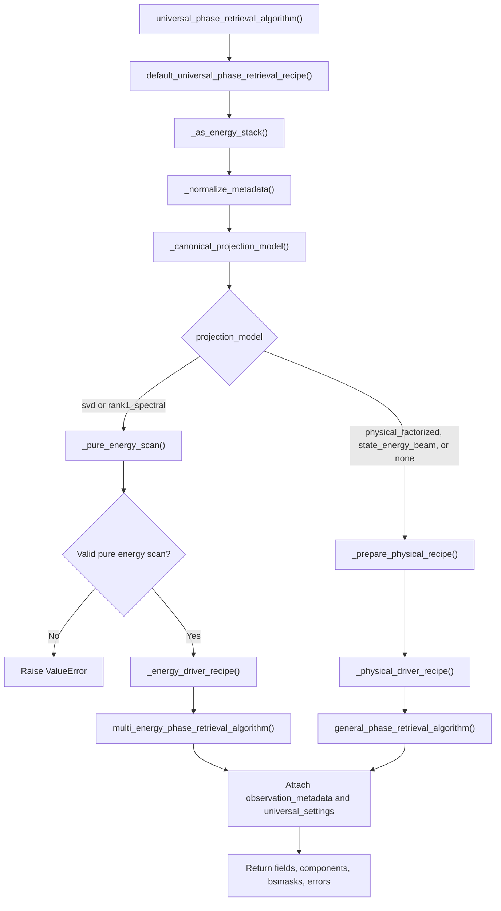

`svd` and `rank1_spectral` use the pure-energy driver because their first
array axis must represent energy only. The physical and linear models use the
general driver because that driver preserves arbitrary state, energy,
polarization, and illumination metadata.

### 8.2 General outer loop

`general_phase_retrieval_algorithm()` runs the mixed-metadata reconstruction.
Its outer loop alternates independent detector/support updates with a shared
object-model projection.

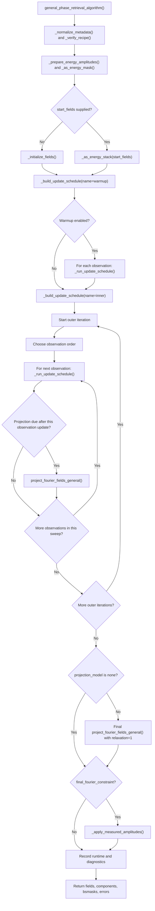

`projection_every` and `projection_start` both count completed observation
updates. The `projection_every` default, `None`, resolves to the number of
observations, preserving one projection per complete sweep. The
`projection_start` default, `None`, resolves to the effective
`projection_every` value, so projection first becomes eligible at the first
cadence boundary. Set `projection_every=1` to apply the shared model after
every observation's complete inner schedule.

### 8.3 Schedule loop for one observation

Both warmup and joint updates use `_run_update_schedule()`. The pure-energy
driver uses the equivalent `_run_energy_update_schedule()`. Each schedule is
built by `_build_update_schedule()` from the recipe's mode, iteration, beta,
alpha, and TV settings.

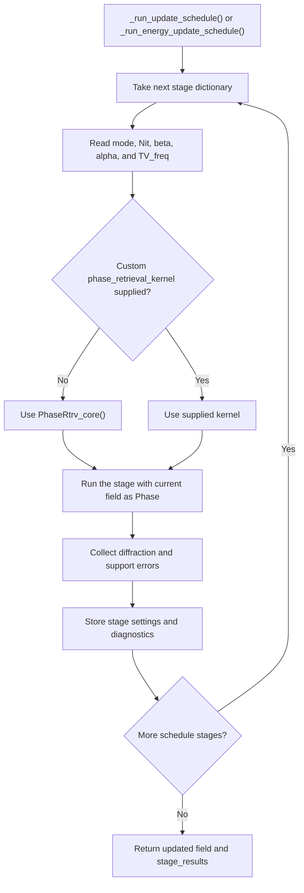

For example, `inner_mode=["HAPRE", "ER"]` and `inner_Nit=[700, 50]`
produce two sequential calls to `PhaseRtrv_core()` for every observation in
every outer iteration. The ER stage starts from the Fourier field returned by
the HAPRE stage.

### 8.4 `PhaseRtrv_core()` iteration loop

`PhaseRtrv_core()` is the innermost numerical phase-retrieval loop. The
projection selected by `mode` is looked up in `PROJECTIONS`; entries include
`_proj_ER()`, `_proj_hapre()`, `_proj_RAAR()`, `_proj_HIO()`, and the other
supported update rules.

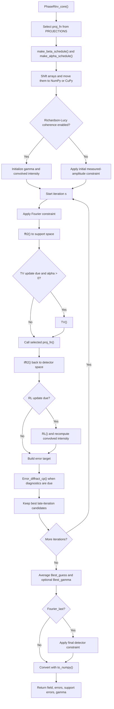

In the universal general and pure-energy drivers, Richardson-Lucy updates are
disabled by passing `gamma=None`, `RL_it=0`, and `RL_freq=Nit+1`. The kernel
still contains the partial-coherence path for standalone use.

### 8.5 General projection dispatcher

`project_fourier_fields_general()` is the boundary between Fourier fields and
the metadata-aware log-object models.

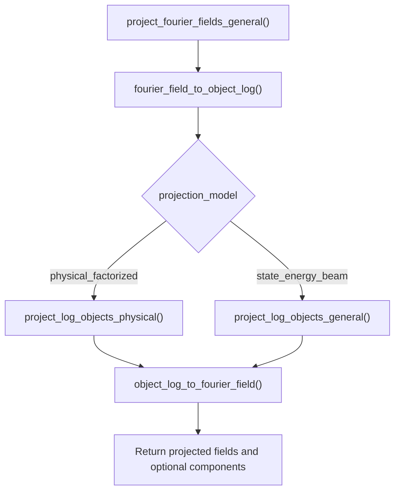

`fourier_field_to_object_log()` performs the inverse Fourier transform,
applies the magnitude floor, and forms the complex log object.
`object_log_to_fourier_field()` exponentiates the projected log object and
returns it to Fourier space.

### 8.6 Physical factorization loop

For `physical_factorized`, one projection performs an alternating fit:

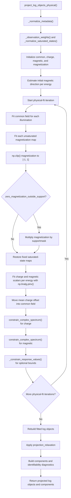

### 8.7 Linear `state_energy_beam` projection

`project_log_objects_general()` implements the flexible linear model. It
constructs one design matrix shared by all pixels and solves all pixel values
in one weighted pseudoinverse operation.

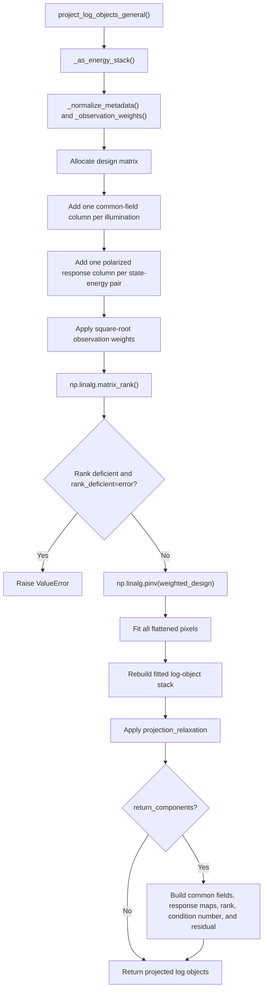

Unlike `project_log_objects_physical()`, this function has no internal
alternating loop. The complete linear model is solved in one pseudoinverse.

### 8.8 Pure-energy outer loop

For `svd` and `rank1_spectral`, `multi_energy_phase_retrieval_algorithm()`
uses the same outer-loop pattern but indexes fields by energy rather than by
arbitrary observation metadata.

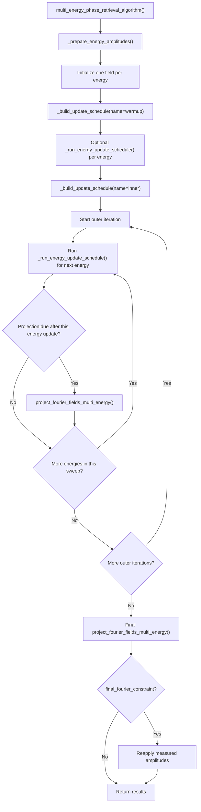

### 8.9 Pure-energy projection dispatcher

`project_fourier_fields_multi_energy()` chooses and applies the requested
cross-energy model.

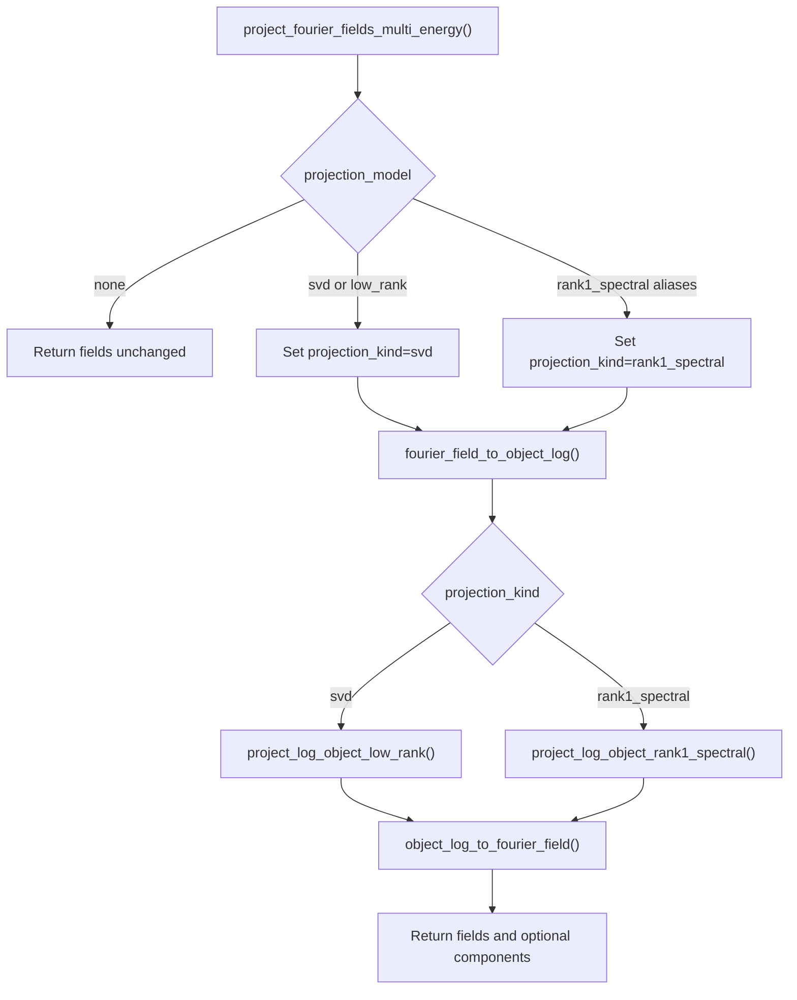

### 8.10 SVD low-rank projection

`project_log_object_low_rank()` separates a static log object from an
energy-dependent residual and truncates that residual to the requested rank.

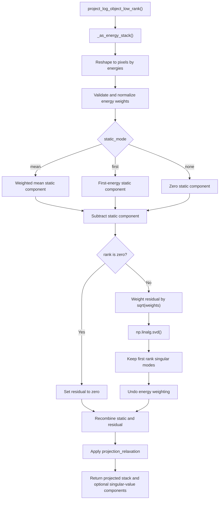

### 8.11 Rank-one spectral projection

`project_log_object_rank1_spectral()` retrieves one spatial map and one
complex energy spectrum, constrains the spectrum, and then refits the spatial
map against the constrained spectrum.

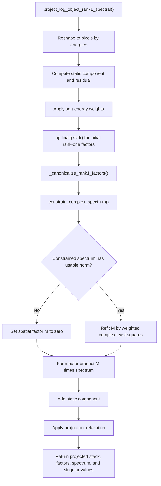

### 8.12 Spectral-constraint branches

`constrain_complex_spectrum()` is shared by the rank-one energy model and by
the charge and magnetic spectra in `project_log_objects_physical()`.

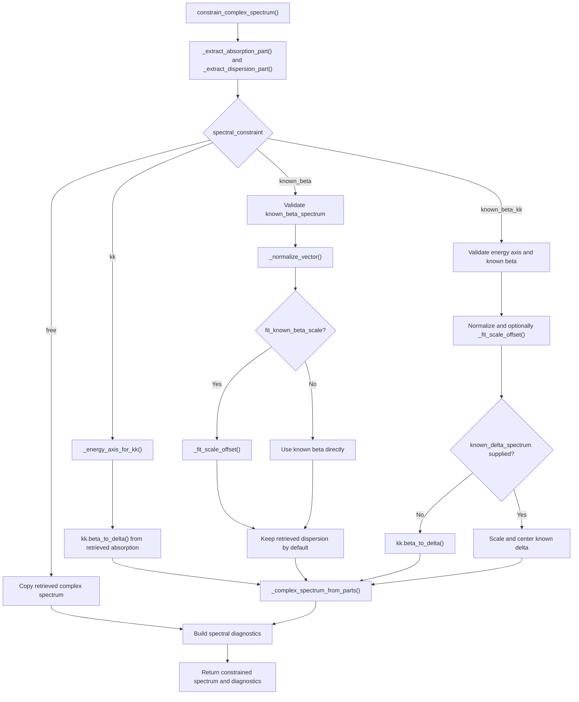

### 8.13 Why alternating fitting helps

Ordinary phase retrieval treats each image independently. Noise, missing
pixels, and non-convex support constraints can then push nominally related
reconstructions toward incompatible solutions.

The universal projection repeatedly brings them back to a shared manifold:

- observations with the same illumination label share $$C_m$$;
- observations at the same energy share $$q_c(E)$$ and $$q_m(E)$$;
- observations of the same state share $$m_z(\mathbf r)$$;
- opposite polarizations must reverse only the magnetic contribution;
- saturated states provide a known magnetic scale.

Information from a well-conditioned observation can therefore stabilize a
more weakly constrained observation.

## 9. Identifiability Conditions

Joint fitting cannot create information absent from the measurement geometry.

### 9.1 Separating charge and magnetic terms

Opposite polarizations at otherwise matching conditions are especially useful:

The polarization-even combination is $$(L_{+}+L_{-})/2 = c_m+q_c(E)$$, while
the polarization-odd combination is $$(L_{+}-L_{-})/2 = q_m(E)m_z$$.

This directly separates polarization-even and polarization-odd contributions.

With only one polarization, separation may still be possible across several
known states or saturated references, but it is less strongly conditioned and
more dependent on the model.

### 9.2 Separating illumination changes

An illumination condition should be connected to the rest of the dataset by
at least one repeated material condition. If every illumination label appears
with a completely unique state-energy-polarization combination, a beam change
can be confused with a material change.

### 9.3 Magnetic scale

At least one saturated state is the clearest way to fix the scale of
$$q_m(E)$$ relative to $$m_z$$. Without saturation or an absolute known
magnetic spectrum, only their product is robustly identified.

### 9.4 Charge offset

An energy-independent complex offset can move between the common illumination
field and the charge response. The implementation fixes this gauge by making
the fitted charge response zero-mean before optional absolute spectral
constraints.

### 9.5 Practical dataset recommendations

For a strongly constrained mixed experiment, aim for:

- at least two energies when retrieving energy dependence;
- both $$p=+1$$ and $$p=-1$$ for representative state-energy conditions;
- at least one saturated state, preferably measured in both polarizations;
- repeated state-energy-polarization conditions across beam changes;
- more observations than the minimum needed by the factorization.

These are recommendations, not unconditional mathematical guarantees. Spatial
support, noise, missing detector pixels, and model mismatch also affect
convergence.

## 10. Complete Recipe Reference

Create defaults with:

```python
from library import phase_retrieval_universal as universal

recipe = universal.default_universal_phase_retrieval_recipe()
```

### 10.1 Iteration schedule

| Key | Default | Meaning |
|---|---:|---|
| `inner_mode` | `["HAPRE"]` | Algorithms run for every observation in each outer loop |
| `inner_Nit` | `[1]` | Iterations for each inner stage |
| `outer_iterations` | `300` | Number of alternating data/model cycles |
| `warmup_mode` | `["HAPRE"]` | Independent pre-coupling algorithms |
| `warmup_Nit` | `[20]` | Warmup iterations; use `0` to disable |
| `shuffle_observations` | `True` | Randomize observation update order |
| `random_seed` | `None` | Seed controlling update-order randomization |
| `beta_zero` | `0.5` | Inner-stage beta value or values |
| `beta_mode` | `"arctan"` | Inner-stage beta schedule or schedules |
| `alpha_zero` | `0.0` | Inner-stage alpha value or values |
| `alpha_mode` | `"const"` | Inner-stage alpha schedule or schedules |
| `TV_freq` | `1e9` | Total-variation update frequency |
| `warmup_beta_zero` | `None` | Warmup beta; `None` inherits inner setting |
| `warmup_beta_mode` | `None` | Warmup beta schedule |
| `warmup_alpha_zero` | `None` | Warmup alpha |
| `warmup_alpha_mode` | `None` | Warmup alpha schedule |
| `warmup_TV_freq` | `None` | Warmup TV frequency |
| `plot_every` | `1e9` | Plot interval passed to the core update |
| `average_img` | `1` | Number of final iterates averaged by a stage |
| `Fourier_last` | `True` | Return each stage in Fourier space |

Scalar beta, alpha, and TV values are broadcast across schedule stages. Lists
must have the same length as the corresponding mode and iteration lists.

### 10.2 Data and projection controls

| Key | Default | Meaning |
|---|---:|---|
| `projection_model` | `"physical_factorized"` | Joint object model |
| `projection_every` | `None` | Completed observation or energy updates between projections; `None` means once per sweep |
| `projection_start` | `None` | Completed update count at which projection first becomes eligible; `None` resolves to `projection_every` |
| `projection_relaxation` | `1.0` | Blend between unprojected and projected objects |
| `projection_constraints_inside_support_only` | `False` | Apply any joint projection only inside `supportmask` after shifting it to the log-object frame |
| `final_fourier_constraint` | `True` | Finish on measured detector amplitudes |
| `hologram_intensity_cutoff_vmin` | `-1` | Intensity cutoff used in amplitude preparation |
| `observation_weights` | `None` | Positive weight per observation |
| `log_floor` | `1e-12` | Magnitude floor before complex logarithm |
| `rank_deficient` | `"error"` | Linear-model behavior for deficient designs |

### 10.3 Physical-factorization controls

| Key | Default | Meaning |
|---|---:|---|
| `physical_iterations` | `20` | Alternating least-squares steps per projection |
| `saturated_states` | `None` | Mapping from state labels to `+1` or `-1` |
| `zero_magnetization_outside_support` | `False` | Force fitted magnetization maps to zero outside `supportmask` after shifting it to the log-object frame |
| `physical_constraints_inside_support_only` | `False` | Backward-compatible alias for `projection_constraints_inside_support_only` |
| `charge_spectral_constraint` | `"free"` | Charge energy-spectrum model |
| `magnetic_spectral_constraint` | `"free"` | Magnetic energy-spectrum model |
| `energy_values` | `None` | Ordered energies in eV |
| `wave_numbers` | `None` | Ordered wave numbers in inverse metres |
| `thickness` | `None` | Thickness in metres for index-to-response conversion |
| `charge_kt_delta_range` | `None` | Bounds on $$kt\delta_c$$ |
| `charge_kt_beta_range` | `None` | Bounds on $$kt\beta_c$$ |
| `magnetic_kt_delta_range` | `None` | Bounds on $$kt\delta_m$$ |
| `magnetic_kt_beta_range` | `None` | Bounds on $$kt\beta_m$$ |
| `charge_response_real_range` | `None` | Advanced direct bounds on `Re(q_c)` |
| `charge_response_imag_range` | `None` | Advanced direct bounds on `Im(q_c)` |
| `magnetic_response_real_range` | `None` | Advanced direct bounds on `Re(q_m)` |
| `magnetic_response_imag_range` | `None` | Advanced direct bounds on `Im(q_m)` |

Do not specify both a `kt` product range and its corresponding direct response
range.

### 10.4 Physical known-spectrum controls

| Key | Default | Meaning |
|---|---:|---|
| `known_charge_beta_spectrum` | `None` | Known charge $$\beta(E)$$ |
| `known_charge_delta_spectrum` | `None` | Known charge $$\delta(E)$$ |
| `known_magnetic_beta_spectrum` | `None` | Known magnetic $$\beta(E)$$ |
| `known_magnetic_delta_spectrum` | `None` | Known magnetic $$\delta(E)$$ |
| `known_charge_kt_beta_spectrum` | `None` | Known $$kt\beta_c(E)$$ |
| `known_charge_kt_delta_spectrum` | `None` | Known $$kt\delta_c(E)$$ |
| `known_magnetic_kt_beta_spectrum` | `None` | Known $$kt\beta_m(E)$$ |
| `known_magnetic_kt_delta_spectrum` | `None` | Known $$kt\delta_m(E)$$ |
| `known_spectrum_normalization` | `"none"` | Normalization of known physical spectra |
| `fit_known_spectrum_scale` | `True` | Fit known physical-spectrum scale |
| `fit_known_spectrum_offset` | `True` | Fit known physical-spectrum offset |

### 10.5 KK controls

| Key | Default | Meaning |
|---|---:|---|
| `kk_sign` | `1.0` | Sign convention applied to the KK result |
| `kk_subtract_baseline` | `True` | Remove endpoint baseline before KK |
| `kk_normalize_input` | `False` | Normalize absorptive input before KK |
| `charge_absorption_part` | `"real"` | Advanced charge response component treated as absorption |
| `magnetic_absorption_part` | `"real"` | Advanced magnetic response component treated as absorption |

The universal physical convention sets the absorption-like part of
$$q=-iktn$$ to its real component.

### 10.6 Pure multi-energy controls

| Key | Default | Meaning |
|---|---:|---|
| `rank` | `1` | Residual rank for `svd` |
| `projection_static_mode` | `"mean"` | Static component used by energy projection |
| `spectral_constraint` | `"free"` | Spectrum model for `rank1_spectral` |
| `known_beta_spectrum` | `None` | Known absorption-like spectrum for rank-one mode |
| `known_delta_spectrum` | `None` | Known dispersion-like spectrum for rank-one mode |
| `absorption_part` | `"real"` | Rank-one component interpreted as absorption |
| `known_beta_normalization` | `"none"` | Rank-one known-spectrum normalization |
| `fit_known_beta_scale` | `True` | Fit rank-one known-spectrum scale |
| `fit_known_beta_offset` | `True` | Fit rank-one known-spectrum offset |

These settings belong to the legacy-compatible pure energy models. For mixed
physical datasets, use the separate charge and magnetic controls instead.

## 11. Usage Examples

### 11.1 Mixed energy, polarization, state, and illumination

```python
import numpy as np
from library import phase_retrieval_universal as universal

recipe = {
    "inner_mode": ["HAPRE", "ER"],
    "inner_Nit": [700, 50],
    "warmup_mode": ["HAPRE", "ER"],
    "warmup_Nit": [700, 50],
    "outer_iterations": 100,
    "projection_model": "physical_factorized",
    "physical_iterations": 20,
    "energy_values": np.asarray(energies_eV),
    "magnetic_spectral_constraint": "free",
    "magnetic_kt_beta_range": (0.01, 0.02),
}

fields, components, bsmasks, errors = (
    universal.universal_phase_retrieval_algorithm(
        holograms,
        mask_pixel,
        supportmask,
        state_labels=state_labels,
        energy_labels=energy_labels,
        polarization_coefficients=polarizations,
        illumination_labels=illumination_labels,
        saturated_states={"sat_up": +1, "sat_down": -1},
        universal_recipe=recipe,
        start_fields=start_fields,
    )
)
```

Important outputs:

```python
components["common_exit_waves"]
components["charge_response"]
components["magnetic_response"]
components["magnetization_by_state"]
components["fit_residual_rms"]
components["magnetic_scale_anchored"]
components["charge_absolute_gauge_anchored"]
```

### 11.2 Pure energy scan with SVD

```python
n_energy = holograms.shape[0]

fields, components, bsmasks, errors = (
    universal.universal_phase_retrieval_algorithm(
        holograms,
        mask_pixel,
        supportmask,
        state_labels=["sample"] * n_energy,
        energy_labels=list(energies_eV),
        polarization_coefficients=[+1] * n_energy,
        illumination_labels=["beam"] * n_energy,
        universal_recipe={
            "projection_model": "svd",
            "rank": 2,
        },
    )
)
```

This uses the pure-energy reconstruction implemented inside the universal
module.

### 11.3 Pure energy scan with a known spectrum

```python
recipe = {
    "projection_model": "rank1_spectral",
    "spectral_constraint": "known_beta_kk",
    "energy_values": energies_eV,
    "known_beta_spectrum": known_absorption_like_response,
}
```

This legacy-compatible mode expects the absorption-like **response spectrum**,
as in the multi-energy library. To provide actual charge and magnetic
refractive-index spectra, use `physical_factorized`.

### 11.4 Independent ordinary phase retrieval

```python
recipe = {
    "projection_model": "none",
    "inner_mode": ["HAPRE", "ER"],
    "inner_Nit": [700, 50],
}
```

Metadata are still recorded, but no joint object constraint is applied.

## 12. Returned Values

`universal_phase_retrieval_algorithm` returns:

```python
fields, components, bsmasks, errors
```

### `fields`

Fourier-domain complex reconstructions with shape `(N, nx, ny)`.

### `components`

The contents depend on the projection model. The physical model includes:

- common log objects and exit waves by illumination label;
- charge response by energy;
- magnetic response by energy;
- magnetization maps by state;
- saturated-state metadata;
- fit residual;
- gauge and identifiability diagnostics;
- spectral-constraint diagnostics;
- the complete observation metadata.

### `bsmasks`

The invalid or unconstrained Fourier-pixel mask used for each observation.

### `errors`

Contains:

- phase-retrieval errors for each schedule stage;
- projection diagnostics;
- runtime;
- resolved internal-driver settings;
- universal settings;
- observation metadata.

## 13. Model Checks and Failure Modes

### Poor fit residual

A large `fit_residual_rms` can indicate:

- incorrect observation labels;
- illumination changes grouped under one label;
- state changes grouped under one label;
- polarization signs assigned incorrectly;
- a sample that does not satisfy the scalar-response-times-real-$$m_z$$ model;
- phase wrapping or branch inconsistencies in the complex logarithm.

### Unstable magnetic scale

Add a saturated state or an absolute magnetic spectral constraint. More states
alone do not necessarily fix the multiplicative ambiguity.

### SVD rejected for a mixed dataset

This is intentional. A global energy SVD cannot safely interpret an axis that
also mixes beam, state, and polarization changes. Use
`physical_factorized`, or split the data into comparable pure-energy scans.

### Overly restrictive bounds

Incorrect `kt` bounds can force a biased solution. Start without bounds,
inspect the unconstrained response, and add physically justified intervals
only when needed.

### Known spectra with no thickness

Actual $$\delta(E)$$ and $$\beta(E)$$ cannot be converted to the measured
dimensionless response without $$kt$$. Supply thickness and either energy or
wave number, or supply the already combined `kt` spectra.

## 14. Recommended Workflow

1. Verify every observation label before reconstruction.
2. Run a short `projection_model="none"` reconstruction to check inputs.
3. Use `state_energy_beam` to test a flexible shared-data model if needed.
4. Switch to `physical_factorized`.
5. Add saturated-state information when available.
6. Inspect fit residuals and retrieved response spectra.
7. Add broad physically justified `kt` bounds.
8. Add known or KK spectral constraints only after checking conventions.
9. Increase the inner and outer iteration counts for the final reconstruction.

The universal model is strongest when the dataset contains deliberate
redundancy: repeated material conditions across beam changes, opposite
polarizations, shared states across energies, and at least one saturated
reference.
