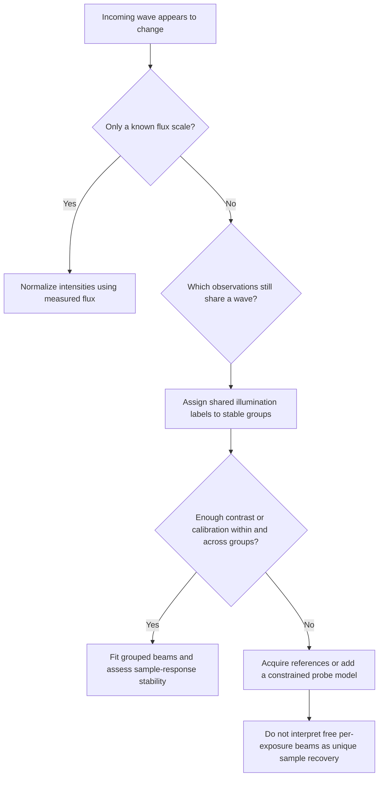
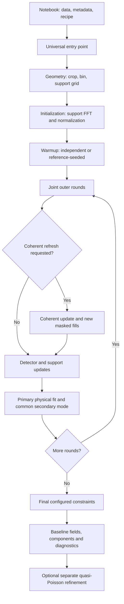
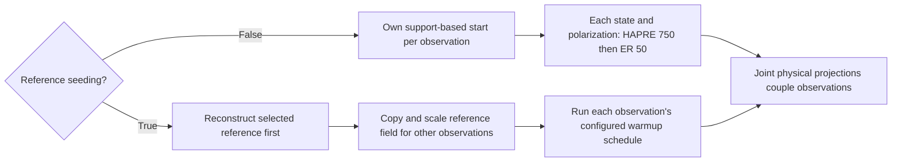
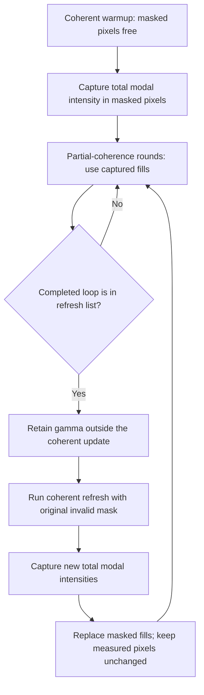
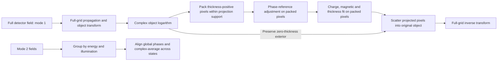
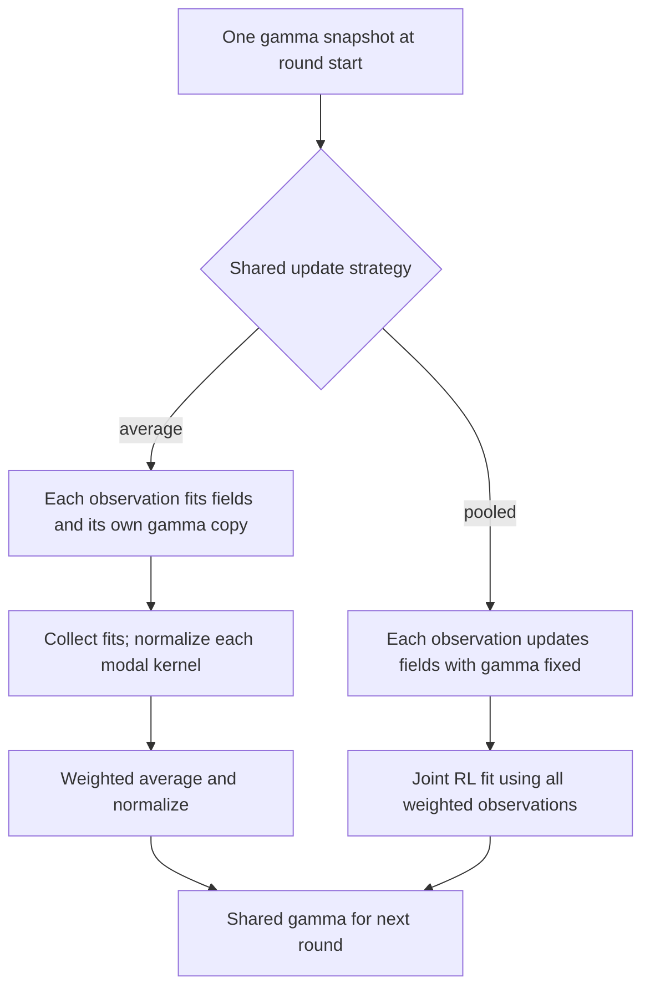
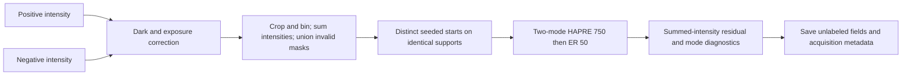

# Universal phase retrieval: user guide

For task-based examples of plain XMCD, hyperspectral, and hysteresis retrieval,
see [Universal reconstruction examples](universal_reconstruction_examples.md).

## Implementation and entry points

Use `library/phase_retrieval_universal.py` for joint state, polarization, energy,
and illumination retrieval. Ajajas 02 and MAX IV 05 use this implementation.
MAX IV's `library/phase_retrieval*.py` entries are relative symbolic links to the
repository library. Keep the repository layout intact and restart kernels after
editing imported modules. Active notebooks import this universal module for retrieval. Ordered-stage
workflows use `phase_retrieval_algorithm` and `default_phase_retrieval_recipe`;
these preserve legacy stage recipes and return formats within universal.
`phase_retrieval_core_unified` is now a compatibility alias pointing to universal;
universal never imports historical retrieval engines. Multimode spectral
initialization, scheduling, and projections also live here;
`phase_retrieval_core_multienergy_multimode` forwards its old API to universal.
Both drivers share the same single/multimode kernel,
iteration schedules, projections and coherence helpers. Metadata-driven joint workflows use
`universal_phase_retrieval_algorithm` and `default_universal_phase_retrieval_recipe`.
These recipe formats are distinct. `mode_supports` builds explicit modal supports;
`multimode_phase_retrieval_kernel` exposes the modal kernel for custom driver hooks.
The historical unified import remains available for older code.

Main entry points:

- `default_universal_phase_retrieval_recipe()` returns a new default dictionary.
- `universal_phase_retrieval_algorithm(...)` validates metadata and dispatches.
- `format_universal_workflow(recipe, state_labels=...)` returns the resolved tree.
- `print_universal_workflow(...)` prints it.
- `plot_universal_workflow(...)` returns a Matplotlib figure; call `plt.show()` or
  `figure.savefig(...)`. Both main notebooks always print and plot before running.
- `general_phase_retrieval_algorithm(...)` is the lower-level joint driver.

Unknown recipe keys raise errors. Prefer the universal wrapper over calling
internal helpers. The default dictionary reference at the end lists every key;
not every option applies to every projection model.

## Arrays and metadata

`holograms` has shape `(observations, rows, columns)` and contains **intensities**,
not amplitudes. `mask_pixel` is either detector-shaped or observation-shaped:
zero means observed; nonzero means invalid/unmeasured. The algorithm's returned
`bsmasks` can additionally mark values rejected by the intensity cutoff. Use an
explicit mask and a negative cutoff when genuine zero observations should count.

`supportmask` describes allowed object-space pixels. The geometry layer applies
crop/binning and support transforms. Modal supports can be supplied where supported;
`modes=[1, 2]` requests two incoherent fields and enlarges the second support by
factor two. The entries describe support factors, not magnetic quantum numbers.

Supply one label/coefficient per observation:

| Argument | Meaning |
|---|---|
| `state_labels` | Which magnetization map applies |
| `energy_labels` | Which spectral response applies |
| `polarization_coefficients` | Magnetic sign/weight, often +1 or −1 |
| `illumination_labels` | Which common illumination applies |

One field returns as `(observations, rows, columns)`; multiple modes add a modal axis
`(observations, len(modes), rows, columns)`. Detector intensity is the **sum of modal
intensities**, not the magnitude squared of the summed complex fields.

## Working example

Assume centered measured intensities, mask and support are already loaded:

```python
import phase_retrieval_universal as universal
import matplotlib.pyplot as plt

recipe = universal.default_universal_phase_retrieval_recipe()
recipe.update(
    modes=[1, 2], mode_initialization="support_fft",
    startimage_scale_fit="through_origin",
    startimage_radial_normalization=True,
    projection_model="physical_factorized",
    constrain_nonphysical_modes_common=True,
    nonphysical_modes_common_relaxation=1.0,
    partial_coherence=True, coherence_kernel_scope="shared",
    shared_coherence_update="average",
    preserve_warmup_masked_intensity=True,
    warmup_mode=["HAPRE", "ER"], warmup_Nit=[200, 50],
    warmup_RL_it=[0, 20], warmup_RL_freq=[10**9, 10],
    inner_mode=["ER"], inner_Nit=[50], RL_it=20, RL_freq=10,
    outer_iterations=10,
    coherent_refresh_rounds=[4, 8],
    coherent_refresh_mode="ER", coherent_refresh_iterations=50,
    projection_every=len(holograms),
    final_projection_relaxation=0,
    observation_workers=2, fft_workers=1,
)
universal.print_universal_workflow(recipe, state_labels=states)
figure = universal.plot_universal_workflow(recipe, state_labels=states)
plt.show()
fields, warmup, components, bsmasks, errors = (
    universal.universal_phase_retrieval_algorithm(
        holograms, mask_pixel, supportmask,
        state_labels=states, energy_labels=energies,
        polarization_coefficients=polarizations,
        illumination_labels=beams, universal_recipe=recipe,
    )
)
```

Iteration counts here are examples, not convergence guarantees. Physical fitting
needs sufficient state/polarization/energy diversity. Inspect identifiability and
residuals in `components`, not just the appearance of a reconstruction.

## What happens, in order

1. Prepare detector/support geometry; validate labels and physical inputs.
2. Initialize fields or copy supplied `start_fields`.
3. Warm up observations, optionally seeding others from a retrieved reference.
4. When masked-fill preservation is enabled, finish **all coherent warmups** before
   starting partial-coherence warmups. Capture each coherent state's intensity.
5. For each outer round: optionally refresh coherently, run detector/support
   updates, then apply physical projections according to the configured cadence.
6. Apply configured final constraints and enforce the common secondary mode.
7. Return fields, warmup snapshot, components, masks and diagnostics.
8. Notebook-only optional quasi-Poisson refinement creates a separate result.

Warmup schedules with preservation must have coherent stages followed by partial
stages; alternating back and forth inside warmup is not supported. Use the explicit
outer-round refresh controls for repeated transitions.

## Initialization and the radial envelope

To reproduce the unified sequential workflow (pos: HAPRE × 750 + ER × 50;
neg: ER × 50 starting from the completed pos solution), order observations as
`[pos, neg]` and configure:

```python
recipe = default_universal_phase_retrieval_recipe()
recipe.update(
    outer_iterations=0,
    warmup_start_from_first=True,
    warmup_reference_observation=0,
    warmup_mode=["HAPRE", "ER"], warmup_Nit=[750, 50],
    warmup_reference_mode=["HAPRE", "ER"], warmup_reference_Nit=[750, 50],
    warmup_other_mode=["ER"], warmup_other_Nit=[50],
    warmup_reference_beta_mode=["arctan", "const"],
    warmup_other_beta_mode="const",
    startimage_scale_fit="through_origin",
    warmup_seed_scale_fit="linear",
    mode_initialization="support_fft",
    average_img=1,
    projection_model="none",
    constrain_nonphysical_modes_common=False,
    final_fourier_constraint=False,
)
```

The scaling settings match the unified support initialization and pos-to-neg
handoff. Each retrieval stage still uses `Fourier_last=True`. Choose the same
`modes`, beta/alpha, averaging and mask settings as in the original recipe.
Zero outer iterations skips joint rounds; configured final constraints still
run, so the example disables them to return the sequential warmup unchanged.
Negative outer iteration counts are rejected.

Both main notebooks default to independent coherent HAPRE × 750 + ER × 50
warmups for every observation, including opposite polarizations. Set
`WARMUP_START_FROM_REFERENCE=True` to seed from the selected reconstructed
reference instead. Ajajas additionally exposes `WARMUP_POLICY`: `same_for_all`
uses this schedule everywhere, while `reference_and_others` enables separate
reference/other schedules. Field seeding and shared-gamma calibration are separate.
Independent support starts do not imply random independent phases; physical
projections subsequently couple the fields but cannot guarantee resolution of
every phase ambiguity.

`mode_initialization="support_fft"` makes modal starts from inverse transforms of
supports; `random_phase` is the multimode alternative. Global normalization uses
`startimage_scale_fit`. `through_origin` avoids fitting an intercept; `linear`
uses a regression slope where supported by the initializer.

With `startimage_radial_normalization=True`, compute one-pixel annular means from
finite, nonnegative hologram samples with `mask_pixel==0`, including true zeros.
For each detector pixel set total modal intensity to its annulus's mean. Preserve
phase and relative modal amplitudes. At an exact zero-field pixel, put the target
amplitude into mode 1 at phase zero. Empty rings interpolate; beyond populated
rings use the nearest endpoint. The center is `(rows//2, columns//2)` on the
prepared detector grid, so first center the experimental diffraction pattern.

This applies after global normalization and to reference-seeded warmup starts.
It does not modify explicitly supplied `start_fields` on entry (later reference
seeding can replace another state's start). It is not a radial-symmetry constraint
on subsequent retrieval. Radial intensity matching can disturb exact initial
support membership; the iterations restore support consistency.

## Coherence, gamma and invalid pixels

`partial_coherence=False` is full coherence. A scheduled partial stage needs
`partial_coherence=True`, positive `RL_it`, and `RL_freq <= Nit`. `RL_it` controls
Richardson–Lucy kernel updates; `RL_freq` controls their cadence. Coherent stages
leave invalid pixels free. Partial stages use captured intensity fills at masked
pixels and fit through the blur model.

| Control | Effect |
|---|---|
| `coherence_kernel_scope="per_observation"` | Each observation has its own gamma |
| `coherence_kernel_scope="shared"` | One gamma shared over observations |
| `shared_coherence_update="sequential"` | Carry the updated gamma to the next observation |
| `shared_coherence_update="average"` | Fit each observation from one snapshot, normalize and weight-average kernels |
| `shared_coherence_update="pooled"` | Hold gamma during field updates, then fit all observations jointly |
| `coherence_round_iterations` | Iterations of the pooled kernel fit |
| `warmup_calibrate_shared_gamma` | Fit the reference kernel before synchronous partial warmup |
| `freeze_coherence_after_reference` | Keep the fitted reference kernel fixed; use shared sequential scope |
| `observation_weights` | Weights in applicable joint/kernel fits |

Average/pooled strategies require shared scope and masked warmup preservation.
A common kernel across energies is an experimental assumption; MAX IV defaults
to per-observation scope. Detector blur and partial coherence can be difficult to
separate; a fitted gamma is not automatically a calibrated detector PSF.

### Partial → full → partial, repeatedly

The notebooks expose `REFRESH_MASK_AFTER_OUTER_LOOPS=[3, 7]`: refresh after
completed loops 3 and 7. They translate this into library before-round indices
`coherent_refresh_rounds=[4, 8]`. Choose completed loops smaller than the total.

Set `coherent_refresh_rounds=[4, 8]` to refresh **before** outer rounds 4 and 8.
Numbers are one-based, unique and no larger than `outer_iterations`. Round 1 is
allowed (it follows warmup). An empty list disables refresh.

Each refresh starts from current fields, runs `coherent_refresh_mode` for
`coherent_refresh_iterations` with RL off, passes the original invalid mask, and
supplies neither gamma nor frozen intensity targets to that update. It inherits
beta/alpha/TV controls from the first inner stage. It then captures total modal
intensity and replaces the fills for subsequent partial updates. Actual observed
intensities are never replaced. Gamma is retained externally and resumes fitting
under the selected strategy. A refresh does not reset the field from support.

All states complete the coherent pass before the next partial round. Frozen
saturated observations stay frozen; their fills are captured unchanged. No
extra physical projection is inserted between refresh and capture. Mode 2 may
vary during this independent pass; the regular common-mode projection restores
its shared form. This is alternating projection, not a guarantee that all
constraints hold after every intermediate operation.

Refresh requires partial coherence enabled and the general driver
(`physical_factorized`, `state_energy_beam`, or `none`). Pure-energy `svd` and
`rank1_spectral` dispatch to a legacy driver and reject refresh. Configure active
partial inner stages to actually resume partial coherence after a refresh.

## Physical model and the secondary mode

The primary log-object is modeled as

`log(object[a]) = log(illumination[beam[a]]) + thickness * (charge[E[a]] + polarization[a] * magnetic[E[a]] * magnetization[state[a]])`.

Only mode 1 enters this model. With `constrain_nonphysical_modes_common=True` and
`nonphysical_modes_common_relaxation=1`, mode 2 is phase-aligned and complex-averaged
within each energy/illumination group. It has no independent magnetic map or
state/polarization variation at the common projection and final output. Different
energies or beams need not have identical secondary fields. Use these settings in
both notebooks; the generic library default leaves this constraint optional.

`projection_relaxation` sets how strongly the physical result replaces the current
primary field. `projection_every`/`projection_start` control cadence. Parallel
updates require projection boundaries at complete observation sweeps.
`physical_iterations` controls the internal physical fit. `final_projection_relaxation=0`
omits an additional final physical replacement. A final Fourier constraint can
alter physical consistency; inspect both detector and physical residuals.

Material controls include `material_mask`, `material_thickness`,
`fit_material_thickness`, known vacuum and support constraints. Set
`physical_projection_object_roi=True` with a thickness map to fit only the material
aperture, preserving the exterior. Full-frame FFT propagation remains necessary.
`physical_phase_reference=True` chooses the nearest relative phase branch within
each energy/beam group before log fitting; it assumes phase differences below π.
It is not a general phase-unwrapping algorithm.

Charge and magnetic spectral constraints, known spectra and bounds can constrain
ill-conditioned fits. Refractive-index spectra require thickness/wave-number
conversion; explicit `kt` products do not. See the complete option inventory and
the validation messages for mutually exclusive inputs. Absolute thickness and
spectral response scale remain coupled without external calibration.

## When the incoming illumination changes

**Notebook switch:** set `ALLOW_VARIABLE_ILLUMINATION=True` and choose
`ILLUMINATION_VARIATION="energy"`, `"state"`, or `"energy_state"`.
MAX IV defaults to grouping by energy; ajajas defaults to grouping by state.
The switch is off by default. When enabled, the notebooks set gamma scope to
`"shared"` across all observations and retain the selected gamma update strategy.
Incoming-wave variation and coherence-kernel fitting remain distinct.
`illumination_group_labels(states, energies, variation=...)` generates the labels;
`variation="common"` reproduces the original single incoming-wave group.
Opposite polarizations within a selected group use the same incoming wave.


The current physical model includes a **complex illumination field** for each
`illumination_labels` group. This represents spatial amplitude and phase in the
physical projection plane. It is distinct from the partial-coherence kernel gamma.

For observation `a`, the primary exit wave is modeled as

`psi[a,r] = P[beam[a],r] * exp(t[r] * (qc[E[a]] + p[a] * qm[E[a]] * mz[state[a],r]))`.

The solver fits `log(P)` as its common log-object term. Consequently, the fitted
common field can also contain sample contributions that the data do not distinguish
from illumination; it is not automatically a uniquely measured incident probe.

### Choose groups according to what is physically shared

| Situation | Illumination labels | Consequence |
|---|---|---|
| One stable incoming wave throughout | Same label for all observations | Strongest sharing; current notebook default |
| Wave changes with energy, stable across states and helicities at each energy | One label per energy group | Independent illumination per energy; states/helicities still share within energy |
| Wave changes between acquisition blocks | One label per measured stable block | Requires repeated/contrasting observations within or connecting blocks |
| Wave changes by state, but opposite helicities share the same wave within each state | One label per state (or state/energy group) | Polarization contrast can remove the shared illumination; absolute response still needs constraints |
| Unknown wave changes independently in every exposure | Unique labels are representable but generally underconstrained | Extra information is needed; arbitrary beam fields can absorb the sample changes |

Use intentional group IDs, not noisy raw energy readings: two measurements meant
to share an illumination must have exactly equal labels. Labels do not impose
smoothness between nearby energies or nearby times.

For MAX IV 05, after `energy_labels` has been formed from the paired/validated
energy groups, replace only the illumination-label assignment if appropriate:

```python
# Stable illumination everywhere (existing default):
illumination_labels = ["beam0"] * len(records)

# Alternative: illumination may change with energy, but is shared by
# opposite polarizations and all states at the same energy.
illumination_labels = [f"beam_energy_{energy}" for energy in energy_labels]

# Alternative: state and energy each define a stable illumination group.
# Only defensible if each group has enough contrast/calibration information.
illumination_labels = [
    f"beam_state_{state}_energy_{energy}"
    for state, energy in zip(states, energy_labels)
]
```

Choose **one** assignment and pass it as `illumination_labels=illumination_labels`
to the universal call. The API also supports arbitrary stable-block labels.
This guide does not change the notebook's existing label assignment automatically.

### What remains measurable, and what becomes ambiguous

If opposite polarizations at the same energy/state see the **same** illumination,
then for their primary exit waves (where defined, with consistent phase gauges),

`psi_plus / psi_minus = exp(2 * t * qm(E) * mz)`.

The common illumination and charge term cancel. This supports extracting magnetic
contrast even when the illumination differs at other energies. Noise, phase
ambiguities, zeros and imperfectly matched polarization exposures still matter.
This equation is for complex exit waves, not a ratio of detector intensities.

However, independent arbitrary illumination at each energy makes the absolute
charge response ambiguous. For any complex energy-dependent number `h(E)`,

`qc(E) -> qc(E) + h(E)` and `P(E,r) -> P(E,r) * exp(-t(r)*h(E))`

leave the exit wave unchanged. A lower residual after adding beam groups does
not prove that the fitted charge spectrum and probe have been separated correctly.
Likewise, if illumination changes between the opposite polarizations, their ratio
contains `P_plus/P_minus`, which can imitate magnetic contrast.

**For ajajas' single-polarization state scan**, assigning an unconstrained beam to
each state is particularly problematic: its free spatial field can reproduce the
state-dependent magnetic signal. Independent warmup starts do not solve this
identifiability problem. Keep states sharing a beam unless there is evidence and
additional information to separate a changing beam from a changing sample.

The physical-factorized `components['identifiable']` flag checks selected scale
anchors; it is not a complete test for all beam/sample ambiguities in an arbitrary
acquisition. Do not use it alone to validate a more flexible illumination model.

### Practical procedure

1. **Separate scalar flux changes from wavefront changes.** For a known positive
   exposure/incident-flux factor `f[a]`, normalize intensities as `I[a]/f[a]`
   (field amplitudes scale as `1/sqrt(f[a])`). Use an independent flux monitor or
   a justified reference. Total scattering can itself change with energy/state,
   so normalizing every image to its own total can remove genuine sample contrast.
2. **Check shared-pair assumptions.** At MAX IV, first assess whether the two
   helicities at each energy have the same incoming wave. If so, per-energy beam
   groups are a sensible model to test while keeping their polarization contrast.
3. **Add only supported flexibility.** Compare the stable-beam and grouped-beam
   models using residuals, recovered magnetic contrast, reference repeatability,
   and charge-spectrum stability. More groups should not be selected merely
   because their fitting residual is smaller.
4. **For unconstrained drift, obtain extra information.** Useful possibilities
   include a calibrated probe/reference measurement, repeated measurements of an
   unchanged state under different beam conditions, opposite-helicity pairs with
   stable illumination, or a restricted drift model (for example known shifts or
   low-dimensional wavefront variation). The present library supports free fields
   per label; it does **not** currently provide a fixed measured-probe input or
   a smooth/low-dimensional probe-drift constraint. Those need an explicit extension.
5. **Keep coherence decisions separate.** Changing illumination labels does not
   change `coherence_kernel_scope`. A spatial wavefront change is not generally
   represented by detector convolution with gamma. Whether gamma is shared is a
   separate assumption about blur/coherence.

Joint object/probe recovery needs measurement redundancy or constraints. For
context, overlapping-position ptychography uses that redundancy to recover both
functions; the present fixed-position joint CDI model does not acquire such
redundancy merely by adding labels. See the primary research example
[Hard X-ray ptychography for optics characterization](https://journals.iucr.org/s/issues/2020/06/00/gb5108/).

### Interaction with ROI and secondary-mode constraints

- With thickness-only physical projection enabled, the illumination/common-field
  fit is performed only at selected positive-thickness pixels. Vacuum/reference
  pixels outside that selection do not automatically calibrate the probe in this
  fit. Expanded component maps outside the ROI are placeholders, not measured
  incoming-wave values.
- The common secondary mode is grouped by **energy and illumination label**.
  Giving each state a different beam label also stops enforcing mode-2 equality
  between those states. Per-energy labels retain equality across states sharing
  that energy. If mode 2 must remain common even across different beam labels,
  its grouping rule needs a separate model change; that is not the current behavior.
- The live view shows reconstructed **exit waves**, not isolated incident probes.
  Common log-object estimates are available in
  `components['common_log_objects_by_beam']`, subject to the ambiguities above.



## Performance, geometry and reproducibility

- `observation_workers` controls concurrent observations; `fft_workers` controls
  FFT threads per worker. Start with 2 and 1. More workers multiply field/history
  memory and can reduce performance. GPU execution uses one observation worker.
- `average_img`, support size, crop and binning strongly affect memory/runtime.
- `crop` removes detector edges before `binning`; binning sums intensities and
  propagates invalid masks. Object support transforms follow the resulting grid.
- `random_seed`, `mode_initialization_seed` and `shuffle_observations` control
  stochastic initialization/order. Save the resolved recipe and metadata.
- Notebook display ROIs use `support_bounding_roi` on the actual retrieval support.

## Outputs, diagnostics and refinement

`warmup` is the snapshot after the configured warmup, including partial warmup if
present. `components` contains fitted physical maps/spectra, geometry, modal
supports and fitted kernels. `errors` contains update/projection records and
resolved settings. `coherent_refresh_steps` records refresh rounds/observations
and frozen status. Set `projection_diagnostic_observation` to trace masked outer
intensity and observed-amplitude residual through projection stages and refreshes.
The workflow figure is a plan, not a convergence plot.

`poisson_refinement.refine_poisson` is a separate projected gradient polish using
a quasi-Poisson objective. For dark-subtracted, thresholded, averaged camera ADU,
it is not a calibrated photon likelihood or the cited paper's exact FIVS method.
Keep baseline fields; refine mode 1 only (`refine_modes=[0]`) to preserve a common
secondary mode; hold gamma fixed. The refined field need not satisfy the joint
physical model, so baseline component maps must not be relabeled as refined maps.

Compare object images with common color limits, predicted detector intensities,
valid-pixel residual/deviance, and optimization histories. Refinement initially
projects onto support; its first loss can exceed the unprojected baseline.

## Troubleshooting

| Symptom | Checks |
|---|---|
| Outer masked artifacts | Initialization, support geometry, phase branch, then coherent refresh; do not freeze masks in full coherence |
| Mode 2 differs across states | Enable common constraint at relaxation 1; compare final outputs within the same energy/beam group |
| Slow parallel run | Memory, worker count, FFT oversubscription, and actual scheduling strategy |
| No apparent gamma updates | Partial flag, RL cadence versus stage length, freeze option, kernel scope |
| Physical fit worsens detector agreement | Relaxation/cadence, material aperture, phase-reference assumption, model identifiability |
| Changes appear ignored | Rerun recipe construction; restart kernel after library edits; inspect printed tree |

## Workflow schematics

These diagrams describe the general driver used by ajajas 02 and MAX IV 05.
The plotted recipe in each notebook resolves the actual iteration counts and
options for that run. Mermaid diagrams render in supporting Markdown viewers;
the text below each diagram gives the same main sequence.

### From notebook to numerical kernels



Sequence: prepare → initialize → warm up → repeat detector/support and physical
updates → return baseline → optionally refine. Projection cadence can postpone
physical updates until later complete sweeps; the diagram shows their logical
position, not a promise to execute a projection on every round.

### Warmup starts: two different choices



`WARMUP_START_FROM_REFERENCE` controls field copying. Ajajas `WARMUP_POLICY`
controls whether reference and other observations receive the same schedule.
These are separate choices. Neither selects the shared-gamma fitting policy.
All coherent warmups finish before the partial warmup when masked-fill
preservation is enabled. Phase coupling does not guarantee that every independent
retrieval ambiguity can be resolved.

### Lifetime of masked diffraction intensities



Notebook example: `REFRESH_MASK_AFTER_OUTER_LOOPS=[3, 7]` means **after** loops
3 and 7. The library receives `coherent_refresh_rounds=[4, 8]`, meaning **before**
rounds 4 and 8. There must be a following partial-coherence round. Frozen
reference observations remain unchanged. Without partial coherence, masked pixels
already remain free and do not need this transition mechanism.

### Physical projection uses positive-thickness pixels



The fit domain is a pixel selection, not a bounding rectangle: holes and
zero-thickness pixels inside a bounding box are excluded too. Coordinate
transforms still require the full grid. The packed physical solve and its phase
adjustment do not. Mode 2 bypasses the magnetic model; it becomes common across
state/polarization at the shared-mode projection.

### Shared gamma: independent averaging versus pooled fitting



`sequential` instead passes each observation's updated gamma directly to the next.
`per_observation` retains a separate kernel per observation. Neither should be
confused with the average strategy, which fits independent copies only within a
round and then makes one common kernel again.

### Reading the source

| Start here | Follow into | Responsibility |
|---|---|---|
| `universal_phase_retrieval_algorithm` | `general_phase_retrieval_algorithm` | Dispatch and observation-level orchestration |
| `_build_update_schedule` | `_run_observation_update`, `_run_update_schedule` | Expand recipe stages, execute one observation |
| `_run_update_schedule` | `PhaseRtrv_core` in the unified core for multimode | Iterative support/detector constraints |
| `_project_physical_modes` | `project_fourier_fields_general`, `project_log_objects_physical` | Primary-mode physical projection |
| `_project_nonphysical_modes_common` | Phase alignment and weighted complex average | Shared nonmagnetic secondary mode |
| `_pooled_coherence_update` | Weighted modal intensity predictions | Shared gamma fit with fields fixed |
| `phase_retrieval_geometry.prepare` | `Geometry.finish` | Input geometry and output metadata |
| `poisson_refinement.refine_poisson` | Forward blur, adjoint blur, line search | Optional post-retrieval refinement |

The universal module also contains historical single/pure-energy entry points.
Follow the dispatch branch matching `projection_model`; a function with a similar
name elsewhere is not necessarily used by the current joint notebook.

## Complete recipe defaults

The following inventory is generated from `default_universal_phase_retrieval_recipe()`.
Arrays/known inputs defaulting to `None` must be provided on the appropriate
observation, energy or object grid. Defaults describe the API; notebooks override
many of them. Keys grouped by prefixes (warmup, known, charge, magnetic, thickness)
apply to their corresponding stage or physical quantity.

| Option | Default |
|---|---|
| `inner_mode` | `['HAPRE']` |
| `inner_Nit` | `[1]` |
| `outer_iterations` | `300` |
| `warmup_mode` | `['HAPRE']` |
| `warmup_Nit` | `[20]` |
| `warmup_reference_mode` | `None` |
| `warmup_reference_Nit` | `None` |
| `warmup_other_mode` | `None` |
| `warmup_other_Nit` | `None` |
| `warmup_start_from_first` | `False` |
| `warmup_reference_observation` | `0` |
| `startimage_scale_fit` | `'linear'` |
| `startimage_radial_normalization` | `False` |
| `warmup_seed_scale_fit` | `'sum'` |
| `warmup_seeded_stage_indices` | `None` |
| `freeze_saturated_fields` | `False` |
| `partial_coherence` | `False` |
| `coherence_kernel_scope` | `'per_observation'` |
| `shared_coherence_update` | `'sequential'` |
| `warmup_calibrate_shared_gamma` | `False` |
| `coherence_round_iterations` | `50` |
| `coherent_refresh_rounds` | `[]` |
| `coherent_refresh_iterations` | `50` |
| `coherent_refresh_mode` | `'ER'` |
| `observation_workers` | `1` |
| `fft_workers` | `1` |
| `preserve_warmup_masked_intensity` | `False` |
| `freeze_coherence_after_reference` | `False` |
| `shuffle_observations` | `True` |
| `random_seed` | `None` |
| `beta_zero` | `0.5` |
| `beta_mode` | `'arctan'` |
| `alpha_zero` | `0.0` |
| `alpha_mode` | `'const'` |
| `TV_freq` | `1000000000.0` |
| `RL_it` | `0` |
| `RL_freq` | `1000000000.0` |
| `warmup_beta_zero` | `None` |
| `warmup_beta_mode` | `None` |
| `warmup_alpha_zero` | `None` |
| `warmup_alpha_mode` | `None` |
| `warmup_TV_freq` | `None` |
| `warmup_RL_it` | `None` |
| `warmup_RL_freq` | `None` |
| `warmup_reference_beta_zero` | `None` |
| `warmup_reference_beta_mode` | `None` |
| `warmup_reference_alpha_zero` | `None` |
| `warmup_reference_alpha_mode` | `None` |
| `warmup_reference_TV_freq` | `None` |
| `warmup_reference_RL_it` | `None` |
| `warmup_reference_RL_freq` | `None` |
| `warmup_other_beta_zero` | `None` |
| `warmup_other_beta_mode` | `None` |
| `warmup_other_alpha_zero` | `None` |
| `warmup_other_alpha_mode` | `None` |
| `warmup_other_TV_freq` | `None` |
| `warmup_other_RL_it` | `None` |
| `warmup_other_RL_freq` | `None` |
| `plot_every` | `1000000000.0` |
| `average_img` | `1` |
| `Fourier_last` | `True` |
| `final_fourier_constraint` | `True` |
| `hologram_intensity_cutoff_vmin` | `-1` |
| `binning` | `1` |
| `crop` | `0` |
| `roi` | `None` |
| `Nmodes` | `1` |
| `modes` | `None` |
| `mode_support_center` | `'image'` |
| `recenter_modal_supports` | `False` |
| `mode_initialization` | `'random_phase'` |
| `mode_initialization_seed` | `0` |
| `constrain_nonphysical_modes_common` | `False` |
| `nonphysical_modes_common_relaxation` | `1.0` |
| `projection_model` | `'physical_factorized'` |
| `projection_every` | `None` |
| `projection_start` | `None` |
| `projection_relaxation` | `1.0` |
| `final_projection_relaxation` | `1.0` |
| `observation_weights` | `None` |
| `rank_deficient` | `'error'` |
| `physical_iterations` | `20` |
| `physical_projection_object_roi` | `False` |
| `physical_phase_reference` | `False` |
| `projection_diagnostic_observation` | `None` |
| `projection_focus_prop_um` | `0.0` |
| `projection_focus_phase_rad` | `0.0` |
| `projection_focus_setup` | `None` |
| `projection_focus_integer_wavelength` | `True` |
| `material_mask` | `None` |
| `material_thickness` | `None` |
| `fit_material_thickness` | `False` |
| `saturated_states` | `None` |
| `zero_magnetization_outside_support` | `False` |
| `zero_thickness_outside_support` | `False` |
| `projection_constraints_inside_support_only` | `False` |
| `physical_constraints_inside_support_only` | `False` |
| `charge_spectral_constraint` | `'free'` |
| `magnetic_spectral_constraint` | `'free'` |
| `energy_values` | `None` |
| `known_charge_beta_spectrum` | `None` |
| `known_charge_delta_spectrum` | `None` |
| `known_magnetic_beta_spectrum` | `None` |
| `known_magnetic_delta_spectrum` | `None` |
| `charge_absorption_part` | `'real'` |
| `magnetic_absorption_part` | `'real'` |
| `charge_response_real_range` | `None` |
| `charge_response_imag_range` | `None` |
| `magnetic_response_real_range` | `None` |
| `magnetic_response_imag_range` | `None` |
| `kk_sign` | `1.0` |
| `kk_subtract_baseline` | `True` |
| `kk_normalize_input` | `False` |
| `known_spectrum_normalization` | `'none'` |
| `fit_known_spectrum_scale` | `True` |
| `fit_known_spectrum_offset` | `True` |
| `log_floor` | `1e-12` |
| `rank` | `1` |
| `projection_static_mode` | `'mean'` |
| `spectral_constraint` | `'free'` |
| `known_beta_spectrum` | `None` |
| `known_delta_spectrum` | `None` |
| `absorption_part` | `'real'` |
| `known_beta_normalization` | `'none'` |
| `fit_known_beta_scale` | `True` |
| `fit_known_beta_offset` | `True` |
| `charge_kt_delta_range` | `None` |
| `charge_kt_beta_range` | `None` |
| `magnetic_kt_delta_range` | `None` |
| `magnetic_kt_beta_range` | `None` |
| `wave_numbers` | `None` |
| `thickness` | `None` |
| `known_charge_kt_beta_spectrum` | `None` |
| `known_charge_kt_delta_spectrum` | `None` |
| `known_magnetic_kt_beta_spectrum` | `None` |
| `known_magnetic_kt_delta_spectrum` | `None` |

## Optional live notebook images

Ajajas 02 and MAX IV 05 expose `LIVE_RECONSTRUCTION` (off by default), `LIVE_OBSERVATIONS`,
`LIVE_EVERY_PROJECTION` and `LIVE_MIN_SECONDS`. Enable it before running retrieval.
The display updates after completed physical projections and on final output;
independent warmup does not yet have a fitted magnetization to show.

Each selected observation shows its state's latest fitted magnetization, plus
focused exit-wave amplitude and phase for every mode. The ROI follows the actual
retrieval support. Magnetization and phase use fixed ranges; amplitude rescales
for each update. Fitted magnetization and current fields can differ in consistency
because physical projection is relaxed and final detector constraints may follow.

The API hook is `progress_callback=callback` on the universal/general driver.
It receives an event dictionary with `stage`, one-based `outer_round`, `fields`,
`components`, `recipe`, `supportmask`, `state_labels`, and `energy_labels`.
Arrays are borrowed; callbacks must not mutate them or retain them as historical
snapshots without copying. The callback is not part of the serialized recipe.
It runs synchronously on the controlling thread; exceptions propagate. The
provided `library.retrieval_live.LiveReconstruction` only transforms selected
observations and updates one IPython display handle, leaving the progress bar
intact. Plotting adds runtime but does not change numerical update settings.

## Cobalt thickness, magnetic scale, and optical constants

### Where the wave number appears

The explicit physical equation, using relative thickness t(r) and reference
physical thickness d0, is

`L_a(r) = c_beam(a)(r) - i*k(E_a)*d0*t(r)*[chi_c(E_a) + p_a*chi_m(E_a)*mz_state(a)(r)]`,

where `chi_c=n_c-1`, `chi_m` is the magnetic index contribution, and
`k(E)=2*pi/lambda(E)=E/(hbar*c)` (a wave number, not photon momentum hbar*k).
The library instead fits `q_c=-i*k*d0*chi_c` and `q_m=-i*k*d0*chi_m`, yielding
its compact `L=c+t*(q_c+p*q_m*mz)` expression. **k is already absorbed in q;
do not multiply the fitted q by k again.** With absolute thickness d(r) rather
than relative t(r), write `-i*k*d(r)` directly and omit d0.

Using `exp(-i*k*n*d)` instead of its vacuum-relative form adds a known vacuum
phase `-k*d`; that reference phase can be included in the common field. It does
not remove the need for k in the material response.

The calibration helper exports wave numbers in inverse nm and complex charge
and magnetic index contrasts. For default sign -1, `chi=-delta-i*beta` and
positive beta attenuates. `PHASE_PROPAGATION_SIGN=+1` supports the opposite
convention, `chi=-delta+i*beta`; its delta conversion changes sign. Select a
convention consistent with the reconstructed phase and external spectra.
This postprocessing switch does not alter the fitted response or the existing
known-spectrum/KK recipe conventions. In particular, the legacy
`known_*_delta_spectrum` adapter maps its supplied delta to negative imaginary
log response; do not assume that switching the export sign changes that input
adapter. The older low-level `response_to_refractive_index` accepts an explicit
`propagation_sign=-1` but retains its historical +1 default for compatibility.


Ajajas 02 and the physical MAX IV 05 expose two **postprocessing** inputs:

```python
COBALT_THICKNESS_NM = None  # Replace with the measured total Co thickness in nm.
NORMALIZE_MAGNETIZATION_TO_UNIT_RANGE = False
```

No thickness is guessed. `None` keeps outputs in dimensionless log-response
units; a positive thickness enables delta/beta plots and saved arrays. The model's
material thickness map must be **relative**, so local Co thickness is the entered
value multiplied by that map. For a fitted map this reference scale must be
interpreted consistently; it is not an independent absolute thickness measurement.
For a multilayer, use the total Co thickness only if the extracted response can
be attributed to cobalt. Other layers can contribute to the charge response.

Using the notebook default `PHASE_PROPAGATION_SIGN=-1`, with
`n=1-delta-i*beta` and `T=exp(-i*k*(n-1)*d)`, the fitted log coefficient is

`q = -k*d*beta + i*k*d*delta`.

Thus `beta=-Re(q)/(k*d)` and `delta=Im(q)/(k*d)`, with
`k=2*pi*E/(1239.8419843320026 eV nm)`. This sign convention is stated explicitly;
conventions that reverse propagation/complex phase need a corresponding change.
The [LBNL X-Ray Data Booklet](https://xdb.lbl.gov/xdb.pdf) describes the complex
index convention. The helper here performs only this algebraic conversion; it
does not calibrate a probe or recover an unknown absolute charge offset.

The reconstruction determines `q_m(E)*m_s(r)`. If normalization is enabled,
compute one scale `s=max(abs(m))` across all states and positive-thickness pixels,
then return `m_new=m/s` and `q_m_new=q_m*s`. The product and predicted exit waves
remain unchanged. This makes the largest magnitude equal one without forcing
both negative and positive extrema to -1 and +1. A min/max affine mapping would
shift the magnetic zero and is deliberately not used. An all-zero map cannot
be normalized and raises a clear error.

The fitted solver already bounds m to [-1,1]; this reporting option does not
change those solver bounds. Leave it disabled when the magnetic scale is already
anchored or when the maximum observed magnetization need not represent saturation.
When enabled without a measured saturation reference it is a chosen normalization,
not proof that the resulting spectrum is the fully saturated Co optical constant.
Magnetic sign and illumination/charge ambiguities remain. Thickness rescales both
charge and magnetic coefficients; changing magnetization scale rescales only the
magnetic coefficient.

`library.retrieval_optical_constants.calibrate_responses` makes copies and returns
postprocessed maps, spectra and calibration metadata. Notebooks keep baseline
components and save the new values in a separate HDF5 `optical_calibration` group.

## One-energy summed-polarization experiment

`maxiv_phase_test/05_maxiv_hyperspectral_phase_retrieval_linear_2modes.ipynb`
now runs **one** chosen `PAIR`, with no physical/spectral projection and no
magnetization or index extraction. The previous version is retained in the local
`legacy/` folder. Select the pair, inspect its energy/field metadata, check exposure
and frame normalization, and run the notebook in order.



`modes=[1,1]` gives both channels the same support. They jointly constrain
`abs(F1)**2+abs(F2)**2` to the measured sum. Separate polarization images are kept
for inspection but are not independent reconstruction targets. The default run
uses full coherence and no TV penalty; the stage recipe is printed and plotted.
Distinct random object phases break exact initialization symmetry. Change
`INITIALIZATION_SEED` to inspect sensitivity; neither seed encodes a helicity.

A polarization sum is not generally a coherently linearly polarized hologram.
For any spatially constant unitary 2x2 matrix U, mixing the two modes with U
preserves summed intensity and their identical supports. Consequently, the modes
cannot be uniquely assigned to positive and negative polarization from this sum
alone. The notebook prints an explicit unitary-mixing invariance check. Separating
physical polarization channels needs additional measurements or constraints, as
also discussed in [Breaking ambiguities in mixed-state ptychography](https://doi.org/10.1364/OE.24.009038).


## Thesis helicity-ratio comparison in MAX IV 05


For each energy and state, use primary-mode `R=psi_positive/psi_negative` in the same focused object plane. Compute `A_xmcd=log(abs(R))` (amplitude, **not intensity**) and `THETA_xmcd=arg(R)` (radians), then **beta_m=-A_xmcd/(2*k*d*mz)** and **delta_m=-THETA_xmcd/(2*k*d*mz)**. The nonmagnetic secondary mode is not included: incoherent modes cannot be summed as complex fields.

Warmup, final, and refined estimates all use the same cobalt thickness and the same postprocessed magnetization map, or the signed scalar `XMCD_MZ_OVERRIDE`. Thus the exit-wave estimator is separate from the spectral fit, but not an independent magnetization calibration when it uses fitted mz. Pixel estimates are averaged with weights `(2*k*d*mz)^2`, equivalently fitting each log ratio through the origin against `2*k*d*mz`. This avoids cancellation of opposite magnetic domains and unstable division near mz=0. Low-amplitude/zero-thickness pixels are excluded; counts and spatial RMS spreads are saved (spreads are not uncertainty estimates).

`XMCD_REFERENCE_PHASE=True` removes the relative global phase using the circular mean ratio phase over illuminated, zero-thickness support/reference pixels. Verify these reference regions are nonmagnetic and share the incoming wave. No amplitude normalization is applied. If no valid phase reference exists, delta is reported as NaN rather than inventing a phase calibration. Setting False uses the raw phase, whose global offset can be arbitrary for independent warmups. Principal-branch phase is used; large phase wraps or spatial phase ramps need additional justified correction. No per-energy normalization to the fitted magnetic spectrum is performed.

**Sign convention:** the plotted universal comparison is also `-Im(q_m)/(k*d)` after matching the same mz calibration. This is the thesis delta convention requested here; for `PHASE_PROPAGATION_SIGN=-1` it is the negative of the earlier native optical-calibration delta. The earlier export is retained unchanged. If refinement is disabled, its curve explicitly duplicates final. A good comparison requires matched illumination for the two helicities; unknown probe changes, phase gauge and modal ambiguity can contaminate it.

The notebook computes a pair per exact validated energy/state, checks that its
polarizations are +1 and -1 and its illumination group agrees, and rejects
ambiguous repeated pairs instead of pairing by adjacent index. It transforms
mode 1 to the same focused, internal object grid as the physical fit. Thickness
and magnetization maps are kept in that frame, avoiding a display-shift mismatch.

Controls: `XMCD_MZ_OVERRIDE=None` uses the postprocessed fitted map for all stages;
a signed scalar supplies an external magnetization assumption instead.
`XMCD_MIN_ABS_MZ` and `XMCD_RELATIVE_AMPLITUDE_FLOOR` exclude unreliable divisions.
`XMCD_REFERENCE_PHASE=True` uses nonmagnetic zero-thickness support pixels as the
phase reference. This must be physically justified; phase spread or beam changes
cannot in general be corrected by a single global phase. If no usable phase
reference exists, beta remains available but delta is NaN. To inspect raw,
unreferenced ratios explicitly set the flag False.

Each stage's universal comparison uses the same valid material pixels and mz
calibration as that stage's ratio estimator. When an external mz override is
used, the model prediction is rescaled by projection onto that same mz map rather
than incorrectly comparing coefficients with different magnetization units.
No intensity/amplitude scale or phase ramp is fitted to force agreement with the
universal spectrum. The curves therefore compare exit-wave contrast against the
model, conditional on the selected calibration and global phase reference.

Results, valid/reference pixel counts, removed phase offsets, phase-reference
status and spatial RMS spreads are saved in `xmcd_ratio_comparison` in the output
HDF5. The group's settings record the calibration, thresholds and refinement
status. With unknown cobalt thickness the cell explains what to enter and skips
physical-index calculation; it does not invent a thickness.


## Arbitrary mode counts and repeated support factors

All of `[1]`, `[1,2]`, `[1,1]`, `[1,1,2]`, `[1,2,3]`, and `[1,1,2,2]`
are accepted. `len(modes)` determines the mode count; entries are finite positive
support-size factors and duplicates are retained. In the physical driver the
first mode must have factor 1. Only that **first mode**, not every factor-1 mode,
receives the physical magnetic/charge fit. All subsequent modes use the configured
nonphysical common-mode constraint per energy/illumination group. Mode count
increases working memory and FFT cost; there is no fixed two-mode limit.

Initialization, supplied starts, gamma arrays, coherent masked-fill capture,
refreshes and final amplitude projections retain the complete modal axis. The
CUDA-JIT front end uses the universal multimode kernel when fallback is enabled;
`fallback=False` explicitly rejects unsupported JIT multimode acceleration.
Pure-energy SVD/rank-one runs dispatch to the existing multimode spectral driver,
inside universal, which applies the spectral projector separately to each mode. Its existing
spectral-driver feature limits still apply; it does not gain physical-driver
coherence refresh or shared physical-thickness fitting simply by using more modes.

Identical supports with `mode_initialization="support_fft"` produce identical
initial modal fields. Use `"random_phase"` or distinct supplied modal starts
when separation of repeated-support modes matters. This breaks initial symmetry,
but does not remove the intrinsic ambiguity of decomposing a measured intensity
sum. The single-pair notebook already uses distinct seeded starts and now allows
other mode lists as well, retaining `[1,1]` as its default experiment.
